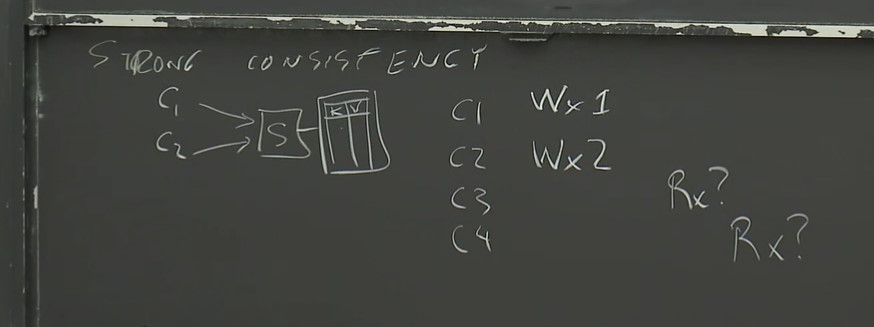
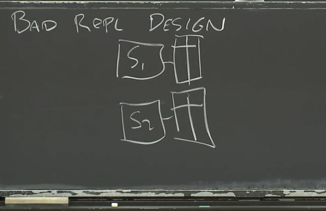
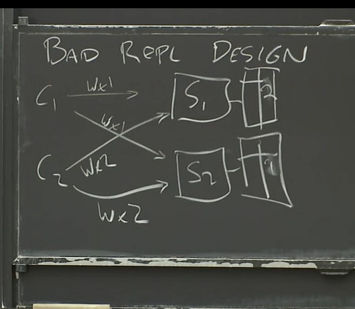

# Distributed System Notes

<h2 align="left">目录</h3>
[toc]

MIT 6.824 分布式系统

## Introduction
MapReduce
https://www.cnblogs.com/gzshan/p/11159033.html


## RPC and Threads

## GFS

## Primary-Backup Replication

**Whether the replication is worthwhile **
多少副本，花多少钱   

方法：
State transfer
Replicated state machines


## GO, Threads and Raft

## Fault Tolerance: Raft(1)

## Fault Tolerance: Raft(2)

## Zookeeper

## More Replication, CRAQ

## Cloud Replicated DB, Aurora

## Cache Consistency: Frangipani

## Distributed Transactions

## Spanner

## Optimistic Concurrency Control

## Big Data: Spark

## Cache Consistency: Memcached at Facebook

## COPS, Causal Consistency

## Fork Consistency, Certificate Transparency

## Bitcoin

## Blockstack


CAP理论


BASE理论

Lecture2

GO: 多线程，垃圾回收机制 
多线程
Convience: 

异步编程，事件驱动编程


Q&A

上下文切换时，所有线程切换吗？
不会，线程是调度的基本单位，只有一个CPU一次只能切换一个线程。两个线程属于相同进程时，切换代价小；当两个线程属于不同进程时，切换代价大

Challenges

共享变量加锁
锁(GO)：（锁与变量没有关系，是某一线程获得一把锁）一个线程拿到锁，其他线程等待直到 unlock 被执行

线程协调（Coordination）
- channels
- sync.cond 条件变量
- waitGroup：阻塞知道一组 goroutine 执行完毕，后面还会提到。

死锁（DeadLock）
T1有A锁，T2有B锁；T1请求B锁，同时T2请求A锁
RPC

```go
func main()

```
map是语言内置的指针

```go
var done sync.WaitGroup
for _, u := range urls {
  done.Add(1)
  go func(u string) {
    defer done.Done()//加defer表示函数结束前调用done.Done()， 且总会被调用
    ConcurrentMutex(u, fetcher, f)
  }(u) // u 被拷贝
}
done.Wait()
```
WaitGroup 内部构成互斥锁  

去掉锁
go run -race crawler.go 潜在含有竞态
该工具没有做静态分析，不会基于源代码进行判断。而是在动态执行过程中观察、记录各个 goroutine 的执行轨迹，进行分析。可能探测到不会发生的bugs


限定线程数量，创建线程池

使用 channel 通信

我们可以实现一个新的爬虫版本，不用锁 + 共享变量，而用 go 中内置的语法：channel 来通信。具体做法类似实现一个生产者消费者模型，使用 channel 做消息队列。

channel 内部互斥锁
不需要关闭channel

Lecture3
Big Storage
抽象的存储
设计优秀的分布式存储系统接口
设计存储系统的结构

GFS在显示世界中使用很长时间

**分布式系统存储空间：**   
Performance->Shareing->faults->tolerance
->replication->inconsistency

consistency 使得 low performance, 很多不喜欢在一致性花时间

**strong consistency**
应用程序或客户端和它通信，感觉就像和一台server通信

C1, C2同时向服务器请求（服务器先处理哪个请求）

单一服务器容错率差, 现实中分布式系系统进行数据备份
->**Bad replication design**
 
假设两个服务器和其存储，要保证两个storage table一样
- 写操作必须在所有server, 那么如果一台server 挂了，写操作就会出现问题

假设两台客户端C1, C2同时向服务器相同位置写入值，服务器没有顺序处理，会产生糟糕结果，S1和S2中的表相同位置值会不同。t如果C3向S1读请求， C4向S2读请求，会读出不一样的结果，陷入可怕陷阱。

修复方法: 服务器之间进行通信。并且存在大量方案解决一致性问题

**GFS**
GFS（2003年发表顶会）如何解决上面问题，作的很好，但是不够完美
GFS将分布式系统设计从学术应用到工业，Google开始应用. 目的解决大存储快速访问问题

需要 global reusable storage system
构建文件系统运行在多个Server上，每个文件都自动的被GFS分割到很多服务器上
当读操作是就很快

GFS只在但数据中心上运行(single data center)
GFS处理大文件的顺序访问。提出Weak consistency, 为了更好性能

每个chunk 64M。
MASTER DATA
file name -> array of chunk hands
chunk handl->list of chunkservers
        version #
        primary
        lease expiration
LOG, CHECHPOINT(snapshot) --- DISK

- name, off -> master
- master sends H, list of Srvs

**写入 WRITES**


