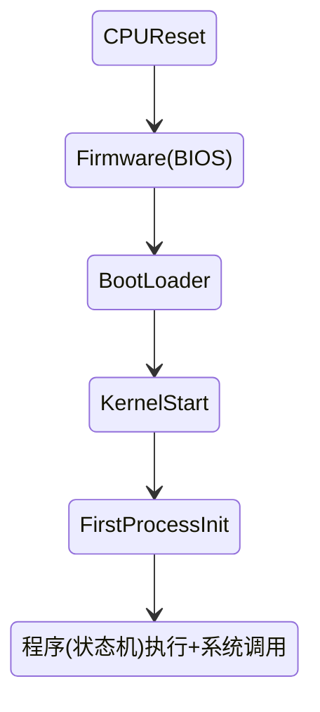

# Operating Systems Notes
<h2 align="left">目录</h2>
[toc]


<!--
机器一定是对的，没有测试的代码一定是错的

C语言状态机模型（语义，semantics）
- 状态=stack frame的列表(每个frame有PC)+全局变量
- 初始状态=main(argc,argv),全局变量初始化
- 迁移=执行top stack frame PC的语句； PC++(程序计数器)
    - 函数调用=push frame(frame PC=入口)
    - 函数返回=pop frame

函数调用时入栈出栈操作
-->

## 计算机系统的硬件组成
如图，为计算机系统的硬件架构图


<h3 align="left"> CPU </h3>

CPU是中央处理单元，32 位和 64 位 CPU 最主要区别在于一次能计算多少字节数据：

- 32 位 CPU 一次可以计算 4 个字节；
- 64 位 CPU 一次可以计算 8 个字节；

这里的 32 位和 64 位，通常称为 CPU 的位宽。

之所以 CPU 要这样设计，是为了能计算更大的数值，如果是 8 位的 CPU，那么一次只能计算 1 个字节 0~255 范围内的数值，这样就无法一次完成计算 10000 * 500 ，于是为了能一次计算大数的运算，CPU 需要支持多个 byte 一起计算，所以 CPU 位宽越大，可以计算的数值就越大，比如说 32 位 CPU 能计算的最大整数是 4294967295。

CPU 内部还有一些组件，常见的有**寄存器、控制单元和逻辑运算单元**等。其中，控制单元负责控制 CPU 工作，逻辑运算单元负责计算，而寄存器可以分为多种类，每种寄存器的功能又不尽相同。CPU 中的寄存器主要作用是存储计算时的数据，你可能好奇为什么有了内存还需要寄存器？原因很简单，因为内存离 CPU 太远了，而寄存器就在 CPU 里，还紧挨着控制单元和逻辑运算单元，自然计算时速度会很快。

常见的寄存器种类：

- **通用寄存器**，用来存放需要进行运算的数据，比如需要进行加和运算的两个数据。
- **程序计数器**，用来存储 CPU 要执行**下一条指令所在的内存地址**，注意不是存储了下一条要执行的指令，此时指令还在内存中，程序计数器只是存储了下一条指令的地址。
- **指令寄存器**，用来存放程序计数器指向的指令（PC从主存中取指令），也就是指令本身，指令被执行完成之前，指令都存储在这里。

<h3 align="left"> 总线 </h3>

系统总线接入一个 I/O 桥（I/O Bridge）(北桥)。这个 I/O 桥接器，一边接入内存总线，使得CPU 和内存通信；另一边呢，接入一个 I/O 总线，用来连接 I/O 设备。真实的计算机里，这个总线层面拆分得更细。根据不同的设备，还会分成独立的 PCI 总线、ISA 总线等，如下图所示。


把总线看作一组“电线”，根据分工不同，总线可以分为三类：
- **数据总线**（Data Bus），用来传输实际的数据信息，也就是实际上了公交车的“人”。
- **地址总线**（Address Bus），用来确定到底把数据传输到哪里去，是内存的某个位置，还是某一个 I/O 设备。这个其实就相当于拿了个纸条，写下了上面的人要下车的站点。
- **控制总线**（Control Bus），用来控制对于总线的访问。虽然我们把总线比喻成了一辆公交车。那么有人想要做公交车的时候，需要告诉公交车司机，这个就是我们的控制信号。
  
当很多设备需要总线时，通过**总线裁决**机制，决定把总线分给哪个设备。


<h3 align="left"> 主存 </h3>
主存是临时存储设备，由DRAM芯片组成，在后面存储器层次结构部分详细介绍。此外主存与虚拟内存与硬盘关系紧密，在后面内存管理部分详细介绍。
<h3 align="left"> I/O设备 </h3>
I/O连接在I/O总线上，是系统与外部世界的联系通道，如图包含几个I/O设备：键盘和鼠标，显示器，磁盘驱动器，网络适配器等。T/O如何工作，后面详细介绍。

<h3 align="left"> 高速缓存 </h3>
由于CPU和主存的速度差距，根据局部性，引入高度缓存Cache, 在后面存储器层次结构部分详细介绍。


## OS启动流程与系统调用
### OS启动流程
操作系统可以看成一个状态机，简要概括Linux操作系统启动流程：
```
CPU Reset → Firmware → Loader → Kernel _start() → 
第一个程序 /bin/init → 程序 (状态机) 执行 + 系统调用
```



### 系统调用 
系统调用是用户程序与内核的接口，Linux操作系统为 (所有) 程序提供 API(系统调用)。这些系统调用涉及进程管理、存储管理和文件管理：
- 进程 (状态机) 管理
fork, execve, exit - 状态机的创建/改变/删除 
- 存储 (地址空间) 管理
mmap - 虚拟地址空间管理
- 文件 (数据对象) 管理
open, close, read, write - 文件访问管理
mkdir, link, unlink - 目录管理

操作系统常用系统调用如下：

> 所有到Linux系统调用的参数都是通过寄存器传递而不是栈传递

## 内存管理
### 物理和虚拟地址

传统的PC和单片机使用物理寻址，如果两个进程或程序访问相同的物理地址，物理地址内容存在覆盖现象，使得两个程序不能同时运行。现在操作系统提供虚拟内存地址机制，为每个进程提供独立的地址空间，相互隔离。每个进程不能访问物理内存地址，通过虚拟内存地址间接访问物理内存地址。将一个虚拟地址转换物理地址的任务称为**地址翻译**，地址翻译需要CPU硬件和操作系统的紧密合作。 CPU 芯片中的内存管理单元（MMU），利用存放在主存中的查询表动态翻译虚拟地址，该表内容由操作系统管理。


> 虚拟内存在磁盘上，是N个连续字节组成的数组，包含虚拟地址空间。每个进程有自己独立的地址空间。
> 物理内存是主存，是M个连续字节组成的数组，包含物理地址空间。

通过虚拟地址访问物理地址需要MMU地址翻译，MMU地址翻译两种机制：**分段机制**和**分页机制**。
### 分段机制
程序是由若干个逻辑分段组成的，如可由代码分段、数据分段、栈段、堆段组成。不同的段是有不同的属性的，所以就用分段（Segmentation）的形式把这些段分离出来。

分段机制下的虚拟地址由两部分组成，**段选择因子**和**段内偏移量**。


段选择因子和段内偏移量：

- **段选择子**就保存在段寄存器里面。段选择子里面最重要的是**段号**，用作段表的索引。**段表**里面保存的是这个**段的基地址**、**段的界限**和**特权等级**等。

- 虚拟地址中的**段内偏移量**应该位于 0 和段界限之间，如果段内偏移量是合法的，就**将段基地址加上段内偏移量得到物理内存地址**。
> MMU根据虚拟地址获得段选因子和段内偏移量，通过段选因子的段号访问到物理内存的段表，从段表取出物理内存段基地址。由于虚拟内存的段偏移地址和物理内存的段偏移地址相同，所以物理内存段基地址加上段内偏移量即可得到实际访问的物理地址。

分段机制缺点：
- 物理内存出现大的外部碎片：物理内存某一段释放，便产生外部碎片
- 内存交换的效率低：**如果内存交换的时候，交换的是一个占内存空间很大的程序，这样整个机器都会显得卡顿**
> <font color=Red>外部碎片多由某一部分内存释放产生；内部碎片多因为内存分配时，为满足某种要求（如双字边界对齐）而产生</font>
> <font color=Red>Swap交换空间从硬盘划分出来，用于虚拟内存（也位于硬盘）与物理内存的空间交换</font>

### 分页机制
为了弥补产生大的外部碎片和内存交换效率低，使用尺寸更小的分页机制，分页机制的虚拟内存才是主流。

**页是把整个虚拟和物理内存空间切成一段段固定尺寸的大小**。这样一个连续并且尺寸固定的内存空间，我们叫**页**（Page）。在 Linux 下，每一页的大小为 4KB。

**弥补大的外部碎片和内存交换效率低**:
- 采用了分页，页与页之间是紧密排列的，所以不会有大的外部碎片。
- 如果内存空间不够，操作系统会把其他正在运行的进程中的「最近没被使用」的物理内存页面给释放掉，也就是暂时写在硬盘Swap中，称为**换出**（Swap Out）。一旦需要的时候，再从硬盘Swap加载到物理内存，称为**换入**（Swap In）。所以，一次性写入磁盘的也只有少数的一个页或者几个页，不会花太多时间，**内存交换的效率就相对比较高**。(换入换出是指磁盘交换空间(Swap)与物理内存的交互，**Swap由内核维护**。)
> 更进一步地，分页的方式使得我们在加载程序的时候，不再需要一次性都把程序加载到物理内存中。我们完全可以在进行虚拟内存和物理内存的页之间的映射之后，并不真的把页加载到物理内存里，而是**只有在程序运行中，需要用到对应虚拟内存页里面的指令和数据时（CPU引用一个虚拟地址），再加载到物理内存里面去**。

**页表**(PT)是存放在物理内存中的数据结构，将虚拟内存地址映射到物理内存地址。MMU每次地址翻译时都会根据虚拟地址读取页表，操作系统负责维护页表。虚拟地址空间中的每个页在页表中的一个固定偏移量处都有一个PTE(和虚拟页的索引VPN相同)。
> 每个进程不仅有自己独立的虚拟地址空间（虚拟地址空间比物理地址空间大，利用Swap）; 还有自己独立的页表。

#### 地址翻译


如图，地址翻译流程：
- CPU生成一个虚拟地址，把它送给MMU;
- MMU根据虚拟地址的**VPN**生成PTE的地址PTEA(PT的**索引**)，并从高速缓存中/主存得到PTE(每个页表条目**PTE由特殊位和物理页号PPN组成**)，进而访问到物理页号PPN;
- 物理页号PPN加上物理页偏移量PPO,得到物理地址PA；MMU把物理地址送到高速缓存中/主存
- 高速缓存中/主存返回所请求的数据给CPU
> 虚拟页偏移量 VPO 和物理页偏移量 PPO相同；VPO 的大小和页的大小有关，在页的取值范围内。

##### TLB加速
CPU每产生一个虚拟地址，MMU必须查询一个PTE, 从主存取出PTE需要即使到几百开销，从L1高速缓存中取出PTE需要1或2个周期。如果大量查询PTE开销很大，如何消除这种代价？

把最常访问的几个页表项存储到访问速度更快的硬件，于是计算机科学家们，就在 CPU 芯片中，加入了一个专门存放程序最常访问的页表项的 Cache，这个 Cache 就是 TLB（Translation Lookaside Buffer） ，通常称为页表缓存、转址旁路缓存、**快表**等。
<div align=center>
   
   
</div>
如图，MMU会首先根据VA的VPN查询TLB，如果TLB命中，则返回PTE，从而得到物理页号PPN, PPN加上VPO可得到PA。如果TLB没有命中，再查询常规页表。TLB 的命中率其实是很高的，因为程序最常访问的页就那么几个。

VPN中包含TLBI和TLBT，TLBI是TLB的组号**索引**，TLB有很多组，每个组有多个TLBT，TLBT是TLB每组中不同PTE对应的**标记号**。

##### 多级页表

对于单页表的实现方式，在 32 位，页大小 4KB和一个4字节的PTE(页表条目)环境下，一个进程的页表需占用 4MB 大小的空间。

二级页表：
假设虚拟地址空间4GB，将一级别页表分成1024个PTE，一级页表的每个PTE 对应一个二级页表，每个二级页表也有1024个PTE，每个二级页表的PTE映射一个4KB的虚拟页(1K * 1K * 4k = 4G)。

每个PTE占用4字节，则一级页表占用4KB主存，二级页表占用4MB主存。那么二级页表为什么可以减少主存的占用呢？
  
- 只有一级页表才需要总是在主存中
- 如果一级页表的PTE是空的，那么二级页表便不存在，虚拟内存系统可以在需要时创建、页面换入或换出二级页表；只有最经常使用的二级页表才需要缓存在主存中。

多级页表：原理类似，可以设计 k 级页表，虚拟地址的VPN也分成 k 段。
<div align=center>

</div>

总结：Core I7地址翻译流程，包含TLB和多级页表。


#### 页面置换算法
**页命中**
CPU 引用虚拟内存中VP3中的一个字，通过MMU从页表中读取PTE3, 得知VP3已被缓存在物理内存中，则称为页命中。(**虚拟页已经和物理建立好映射关系**)

**缺页**
CPU 引用虚拟内存中VP3中的一个字，通过MMU从页表中读取PTE3,得知VP3没有被缓存在物理内存中，DRAM缓存不命中称为**缺页**。产生缺页现象时，CPU向内核发送缺页中断请求，内核调用缺页中断处理程序。(**虚拟页没有和物理页建立好映射关系，根据物理内存是否足够分两种情况**)
缺页中断处理流程如下图：
<div align=center>

</div>

1. 在 CPU 里访问一条 Load M 指令，然后 MMU 会去找 M 所对应的PTE。
2. 如果该页表项的状态位是「有效的」（页命中），那 CPU 就可以直接去访问物理内存了，如果状态位是「无效的」（缺页），则 CPU 则会发送缺页中断请求。
3. 内核收到了缺页中断，执行缺页中断处理程序，先找到虚拟内存的虚拟页。
4. 
   - 如果物理内存有空闲页：
      - 把虚拟页从交换空间**换入**到该物理页中
   - 如果物理内存没有空闲页，需要「页面置换算法」选择一个物理页作为牺牲页:
      - 如果该物理页有被修改过（脏页），则把它**换出**到硬盘，然后把该物理页对应的PTE的状态改成「无效的」
      - 把虚拟页从交换空间**换入**到该物理页中
5. 把该物理页对应的PTE的状态位修改为「有效的」
6. 最后，CPU 重新执行导致缺页中断的指令。
(**此时，虚拟页已经和物理建立好映射关系**)

基于以上分析，可以画出虚拟内存的整个管理流程如下图：

<div align=center>

</div>

页面置换算法的功能是：**当出现缺页异常，主存的物理页已满，选择被置换的物理页面**，也就是说选择一个物理页面换出到硬盘，然后把需要访问的虚拟页换入到物理页。

那其算法目标则是，**尽可能减少页面的换入换出的次数**，常见的页面置换算法有如下几种：


|置换算法类型      | 算法基本思想 |    优缺点           | 
|:----:    | :---    |    :----:  | 
|最佳页面置换算法（OPT）  | 置换在「未来」最长时间不访问的页面    | 理想算法，效率高，实际中无法实现   |
|先进先出置换算法（FIFO）  | 置换在内存驻留时间很长的页面 | 比OPT性能差      | 不可以  |
|最近最久未使用的置换算法（LRU）| 选择最长时间没有被访问的页面进行置换   | 比FIFO性能好些，但是实现代价大，实际应用中使用少| 
|时钟页面置换算法（Lock）  | 页面都被保存环形链表中，一个表针指向最老的页面| 兼顾LRU和FIFO优点，既能优化置换的次数，也能方便实现 | 
|最不常用置换算法（LFU）  | 置换「访问次数」最少的那个页面| 需要额外计数器，耗时大，效率不高 | 
> **以上分析属于是正常的缺页异常，此外还有两种缺页异常：**
>  - 虚拟地址A不合法： 缺页异常处理程序触发**段错误**（访问一个不存在页面），终止进程的执行；
> - 试图进行访问的内存不合法（权限问题）：缺页异常处理程序触发**保护异常**（如写入一个只读页面），终止进程的执行；

> **页面置换算法属于操作系统的内存调度，此外还有操作系统的CPU调度和I/O调度**。

### Linux进程虚拟内存
#### 进程的虚拟内存
Linux虚拟内存**段**（区域）：已经存在的（已分配的）虚拟内存的**连续片**(chunk)。不存在不属于某个段的虚拟页，内核不用记录哪些不存在的页。（**段之间有间隙**）

Linux 系统主要采用了分页管理，但是由于 Intel 处理器的发展史，Linux 系统无法避免分段管理。于是 Linux 就把所有**段**的基地址设为 0，也就意味着所有程序的地址空间都是线性地址空间（虚拟地址），相当于屏蔽了 CPU 逻辑地址的概念，所以段只被用于访问控制和内存保护。

**Linux为每个进程维护一个单独的虚拟地址空间**（进程地址空间隔离），虚拟地址空间的内部又被分为**内核空间**和**用户空间**两部分：
- 32 位系统的内核空间占用 1G，位于最高处，剩下的 3G 是用户空间(进程最多可以申请3GB的虚拟内存)；
- 64 位系统的内核空间和用户空间都是 128T，分别占据整个内存空间的最高和最低处，剩下的中间部分是未定义的。

内核空间与用户空间的区别：
- 进程在用户态时，只能访问用户空间内存；
- 只有进入内核态后，才可以访问内核空间的内存；
  
一个进程的虚拟内存如图所示（虚拟地址由下到上变大）：
<div align=center>

</div>


**进程的内核虚拟地址空间**：包含内核中的代码和数据结构
- 每个进程有自己独立的数据结构，如页表、task和mm结构，内核栈
- 某些区域被映射到所有进程共享的物理页面
- 每个进程共享内核代码和数据结构

**进程的用户虚拟地址空间**：包含代码段、数据段、堆段、共享库段和栈段。
- 代码段（.text），包括二进制可执行代码；
- 已初始化数据段（.data），（全局初始化区）包括初始化的全局变量和静态变量
- 未初始化数据段（.bss），（全局未初始化区）包括未初始化的全局变量和静态变量
- 堆段，包括动态分配的内存，从低地址开始向上增长；
- 共享库的内存映射段：libc.so动态库等
- 栈段：包括局部变量和函数调用的上下文等。栈的大小是固定的，一般是 8 MB，从高地址向下生长。
> 代码段和数据段是 exceve() 将可执行文件加载到进程虚拟内存的部分
  
**任务结构task_struct**
内核为每个进程维护一个单独的**任务结构**，其包含或指向内核运行该进程所需的所有信息（如PID、指向用户栈的指针、可执行文件的名字，以及程序计数器）


- pgd字段指向第一级页表的基址。内核运行这个程序，将pgd放CR3控制寄存器中
- mmap字段指向一个vm_area_struct(区域结构)的链表
   - vm_start: 指向这个区域的起始处
   - vm_end: 指向这个区域的结束处
   - vm_prot: 描述这个区域内所包含所有页得读写权限
   - vm_flags: 描述这个区域是**私有区域**还是**公有区域**；
   - vm_next: 指向链表得下一区域结构


#### 虚拟内存映射
**内存映射**: Linux通过将一个虚拟内存段与一个硬盘文件对象关联起来，**以初始化这个虚拟内存区域的过程**。虚拟内存区域被初始化后，就会在交换空间中换来换去
可以映射两种文件对象：
- 普通文件对象：普通文件在磁盘中。文件区被分成页大小的片，每一片包含虚拟页面的初始内容。当CPU引用虚拟页面时，该页面才交换进入物理内存。如可执行文件，**.data段、.text段、共享库的内存映射段属于普通文件的映射段**。
- 匿名文件对象：由内核创建，包含的全是二进制零。当换入时，虚拟内存已满，选择牺牲页，如果该页被修改，将其换出，用二进制零填充该物理页，等待换入。**堆段、栈段、.bss段都是匿名文件映射段**，**这些段的虚拟页并不和磁盘中的文件对象发生映射**。

文件对象（可以是普通文件也可以是匿名文件）被映射到虚拟内存的一个区域，这个对象可以是**共享对象**，也可以是**私有对象**。**共享对象**被映射的虚拟内存区域叫**共享区域**，类似也有**私有区域**。
> **私有区域包含：代码段、数据段、bss段、堆段、栈段**
> **共享区域包含：共享库的内存映射段**，

1. 多个进程映射同一个共享对象

共享对象分别被映射到两个进程的共享区域，**进程1对其共享区域的修改，这种修改对进程2对应的共享区域也是可见的，也会修改原始的共享文件对象**。
> 普通文件对象即使被映射到多个区域，物理内存也只存放共享对象的一个**副本**。
> 图中物理内存显示的连续的，实际中未必连续。

2. 多个进程映射同一个私有对象


私有对象使用**写时复制技巧**，两个进程将一个私有对象映射到各自虚拟内存的不同区域，但共享这个私有对象的同一物理副本。页表条目PTE将这些区域标记为只读的。
- 当没有进程修改其私有区域，则他们继续共享这个私有对象的同一物理副本；
- 当有进程修改其私有区域，触发**保护故障**，该进程在物理内存创建这个页的副本， PTE指向新的副本，恢复这个物理页面的读写权限。

**用户空间调用mmap库函数：Linux进程在用户态使用mmap函数在进程用户空间创建新的虚拟内存区域（段），并将硬盘普通文件对象映射到这些区域中**。

**内核空间调用mmap库函数：Linux进程在内核态使用mmap函数在进程用户空间创建新的虚拟内存区域，将内核创建的匿名文件对象以私有的方式映射到该区域(malloc调用mmap在堆里动态内存分配)**。

**<font color=Red> mmap很复杂，用户空间调用mmap和内核空间调用mmap不同，这里只简单分析用户空间调用的mmap</font>**

**执行流程**
- 进程在用户空间调用库函数mmap;
- 在当前进程的虚拟地址空间中，寻找一段空闲的满足要求的连续的虚拟地址。
- 为此虚拟区分配一个vm_area_struct结构，接着对这个结构的各个域进行了初始化。
- 将新建的虚拟区结构（vm_area_struct）插入进程的虚拟地址区域链表或树中。

**函数说明**
```c
#include <sys/mman.h>
void *mmap(void *start, size_t length, int prot, int flags, int fd, off_t offset);
//若成功时返回指向映射区域的指针，失败则为MAP_FAILED(-1)
```
- start：映射区的开始地址
- length：映射区的长度
- prot：期望的内存保护标志，vm_area_struct的prot位
   - PROT_EXEC: 页内容可以被执行
   - PROT_READ: 页内容可以被读取
   - PROT_WRITE: 页可以被写入
   - PROT_NONE: 页不可访问
- flags：指定映射对象的类型
  - MAP_ANON: 匿名对象
  - MAP_SHARED: 共享对象
  - MAP_PRIVATE: 私有的，写时复制内向
> **pmap通过访问procfs查看进程的地址空间**
> mmap可以**映射整个磁盘文件对象**； 也可以映射**匿名文件对象**方式，以**私有匿名映射方式**通过内核创建虚拟内存页（如malloc通过mmap申请堆段虚拟页）。虽然私有匿名映射需要切换到内核态，但mmap的这两种映射是瞬间完成的。

### 虚拟内存动态分配
#### malloc
malloc() 并不是系统调用，而是 C 库里的函数，用于动态分配内存。**malloc()分配的是虚拟内存**。
malloc 申请内存的时候，会有两种方式向操作系统申请堆内存。
- 通过 brk() 系统调用从堆分配虚拟内存: 通过 brk() 函数将「堆顶」指针**brk**向高地址移动，获得新的内存空间
- 通过 mmap() 系统调用以**私有匿名映射**方式在进程用户空间创建新的虚拟内存区域（段），这些段由内核创建不与硬盘文件对象发生映射；
> 如果用户分配的内存小于 128 KB，则通过 brk() 申请内存；
> 如果用户分配的内存大于等于 128 KB，则通过 mmap() 申请内存；

malloc() 在分配内存的时候，并不是按用户预期申请的字节数来分配内存空间大小，而是会**预分配更大的空间作为内存池**。具体会预分配多大的空间，跟 malloc 使用的内存管理器有关系。以Ptmalloc2为例子：**malloc(1) 实际上预分配 132K 字节的内存**。


#### free
- malloc 通过 brk() 方式申请的内存，free 释放内存的时候，**并不会把内存归还给操作系统，而是缓存在 malloc 的内存池中，待下次使用**；
- malloc 通过 mmap() 方式申请的内存，free 释放内存的时候，**会把内存归还给操作系统，内存得到真正的释放**。

malloc 返回的起始地址比进程的堆空间起始地址多了 16 字节，用来保存该内存块的描述信息。当执行 free() 函数时，free 会对传入进来的内存地址向左偏移 16 字节，然后根据这 16 字节来确定所释放内存的大小。

**mmap和brk比较**
如果**频繁通过 mmap 分配的内存话，不仅每次都会发生运行态的切换，还会发生缺页中断（在第一次访问虚拟地址后），这样会导致 CPU 消耗较大**。而brk()直接预分配更大的内存来作为内存池，当内存释放的时候，就缓存在内存池中。**等下次在申请内存的时候，就直接从内存池取出对应的内存块就行了，而且可能这个内存块的虚拟地址与物理地址的映射关系还存在，这样不仅减少了运行态切换的次数，也减少了缺页中断的次数，这将大大降低 CPU 的消耗**。但是brk方式free时，由于释放的内存没有归还给操作系统，容易造成**外部碎片**。
> mmap分配的内存生命周期较长，brk分配的内存的生命周期较短
### 主存回收
**回收对象**
当产生缺页中断时，如果物理内存已满，内核就进行内存回收。内存回收主要是针对匿名页和文件页进行的。
- 匿名页： 内存回收过程中会筛选出一些不经常使用的匿名页，将它们写入到swap分区中，然后作为空闲页释放到伙伴系统。
- 文件页：内存回收过程中也会筛选出一些不经常使用的文件页，如果是**干净页**，直接将此页作为空闲页释放到伙伴系统中；如果是**脏页**，回写到硬盘所对应数据位置，再将此页作为空闲页释放到伙伴系统中。
> 脏页：文件页中保存的内容与磁盘中文件对应内容不一致
> 干净页：文件页中保存的内容与磁盘中文件对应内容一致
> **内存回收对系统I/O造成压力，影响系统性能。因为脏页比较少，且干净页回收不消耗系统I/O，所以匿名页回收更占用内存**

**回收过程**
1. **后台内存回收**（kswapd）：在物理内存紧张的时候，会唤醒 kswapd 内核线程来回收内存，这个回收内存的过程**异步**的，不会阻塞进程的执行。
2. **直接内存回收**（direct reclaim）：如果后台异步回收跟不上进程内存申请的速度，就会开始直接回收，这个回收内存的过程是同步的，会阻塞进程的执行。
   > **会造成很长时间的延迟，以及系统的 CPU 利用率会升高，最终引起系统负荷飙高**。
3. 如果直接内存回收后，空闲的物理内存仍然无法满足此次物理内存的申请，那么内核就会放最后的大招了 ——触发**OOM （Out of Memory）机制**。
   - OOM Killer 机制会根据算法选择一个占用物理内存较高的进程，然后将其杀死，以便释放内存资源，如果物理内存依然不足，OOM Killer 会继续杀死占用物理内存较高的进程，直到释放足够的内存位置。
   > OOM killer 就会根据每个进程的内存占用情况和 oom_score_adj 的值进行打分，得分最高的进程就会被首先杀掉。通过调整进程的 /proc/[pid]/oom_score_adj 值，来降低被 OOM killer 杀掉的概率

**提高回收性能**
- 设置 /proc/sys/vm/swappiness，调整文件页和匿名页的回收倾向，尽量倾向于回收文件页；
- 设置 /proc/sys/vm/min_free_kbytes，调整 kswapd 内核线程异步回收内存的时机；
- 设置 /proc/sys/vm/zone_reclaim_mode，调整 NUMA 架构下内存回收策略，建议设置为 0。

## 进程管理
**异常基础**
异常是异常控制流的一种形式，它一部分由硬件实现，一部分由操作系统实现。
|类别    |     原因         |  异步 / 同步 | 返回行为                   |描述|
|:----:  | :---             | :----:   |  :----                     |:----|
|中断    | 来自I/O设备的信号 | 异步      | 总是返回到下一条指令         |来自I/O设备    |
|陷阱    | 有意的异常        | 同步      | 总是返回到下一条指令         |系统调用   |
|故障    | 潜在可恢复的错误   | 同步      | 可能返回到当前指令也可能终止 |缺页、一般保护故障、除法错误|
|终止    | 不可恢复的错误     | 同步      | 不会返回                   |    |
系统中每个异常都有一个无符号整数的异常号，**故障和终止**的异常号(0\~31)是CPU设计者分配的，如**被零除、缺页、断点以及算数运算溢出**；**中断和陷阱**的异常号(32\~255)由内核分配，如**系统调用和I/O中断**。
|异常号  |     描述                         |  异常类型 | 
|:----:  | :---                            | :----:   |  
|0       | 除法错误                         | 故障     | 
|13      | 一般保护故障                     | 故障     | 
|14      | 缺页                             | 故障     | 
|18      | 机器检查                         | 终止     |
|32\~255 | 内核定义的异常(系统调用，I/O中断等)| 中断和异常|  

**内核空间和用户空间**   
处理器用某个控制寄存器的**位模式**来控制进程在用户空间还是内核空间。设置位模式进入内核空间。
<div align=center>
   
</div>

如图，用户空间包含应用程序、shell、libc，他们的关系在图中可以看到。
用户空间的程序必须通过**系统调用**接口间接的访问内核空间的代码和数据。进程从用户空间进入内核空间是通过如**中断、故障、陷入系统调用**这样的异常。


### 进程的状态


- **新生状态(New)**:进程被创建，未完成初始化，不能被调度执行。在经过**初始化**之后进程迁移至**预备状态**。
- **预备状态(Ready)**:该状态表示进程可以被调度执行,但还未被调度器选择。由于CPU数量可能少于进程数量，在某一时刻只有部分进程能被调度到CPU上执行。此时系统中其他的可被调度的进程都处于预备状态。在被调度器选择执行后，进程迁移至**运行状态**；**运行状态**的进程时间片用完了，回到**预备状态**
- **运行状态(Running)**: 该状态表示进程正在CPU上运行。当进程的时间片用完了，迁移至**就绪状态**: 当进程终止运行，迁移至**终止状态**；如果—个进程需要等待某些外部事件，它可以放弃CPU并迁移至**阻塞状态**。
- **阻塞状态(Running)**: 该状态表示进程需要等待外部事件（如某个I／O请求的完成），暂时无法被调度。当进程等待的外部事件完成后,它会迁移至**预备状态**。
- **挂起状态(Suspended)**: 如果物理内存比较紧张，调度器会考虑把就绪状态的进程和阻塞状态的进程挂起，他们被换出到硬盘中。等待被激活，重新进入**就绪队列和阻塞队列**。
- **终止状态(Exit)**:进程永远停止了。

### 进程控制

#### 进程控制块
进程控制块（ProcessControlBlock, PCB）是进程内核空间的任务结构 **task_struct**，保存进程的相关状态，如迸程标识符（PID）、进程状态、虚拟内存状态、打开的文件等。


```c
struct task_struct {
	volatile long state;	/* -1 unrunnable, 0 runnable, >0 stopped */
	struct mm_struct *mm; /*管理虚拟内地址和链表*/
	pid_t pid;   //
	pid_t tgid;  //
/* filesystem information */
	struct fs_struct *fs;
/* open file information */
	struct files_struct *files;
/* signal handlers */
	spinlock_t sigmask_lock;	/* Protects signal and blocked */
	struct signal_struct *sig;
   ...
};
```
**tid与tgid**:
内核为每一个线程维护一个独立的task_struct，tid其实是线程的id; 一个进程可以有很多线程，那个许多个线程组成线程组的id是tgid，tgid其实就是一个进程的id。当一个进程没有创建线程时tid与pgid相同；当线程被创建，pgid保持不变，pid会改变。

#### 进程创建
父进程通过``fork()``创建一个新的运行的子进程：
```c
#include <sys/types.h>
#include <unistd.h>
pid_t fork()
// 返回：子进程返回0，父进程返回子进程的PID，如果出错返回-1
```
新建的子进程和父进程几乎但不完全一样，子进程是父进程的一个副本，他们**具有相同但是独立的虚拟地址空间，包括寄存器值，代码和数据段、堆段、栈段以及共享库**。他们共享文件对象，对私有文件对象，遵循私有写时拷贝。他们**最大的区别是有不同的进程PID**。**``fork()``返回两次，在父进程中返回子进程的PID，在子进程中返回0**。
```
pid_t pid = fork();
if(pid == 0) {
   ... //子进程中
   exit(0);
} else {
   ... //父进程中
}
```
可以把进程看成状态机，父进程创建子进程后，他们进入新的状态，在这个状态中父进程和子进程同时存在，即**父进程和子进程是并发运行的独立进程**。
```
fork ();   // Line 1
fork ();   // Line 2
fork ();   // Line 3

       L1       // There will be 1 child process 
    /     \     // created by line 1.
  L2      L2    // There will be 2 child processes
 /  \    /  \   //  created by line 2
L3  L3  L3  L3  // There will be 4 child processes 
                // created by line 3
```

**fork()应用**
1. 搜索并行化：避免一步一步回溯，直接回到原始状态
2. 跳过初始化：
   - Zygote Process (Android)
      - Java Virtual Machine 初始化涉及大量的类加载
      - 一次加载，全员使用：App 使用的系统资源，基础类库，libc等
   - Chrome site isolation (Chrome)
   - Fork server (AFL)
3. 备份和容错：针对有bug的程序可以用fork()做一个快照，当主程序crash时，启动快照重新执行


**fork()的局限性**
fork() 可能不是最佳API: fork()最初的设计是简单优雅的。
但在操作系统的演化过程中，为进程增加了更多的东西：
- 信号 (信号处理程序，操作系统负责维护)
- 线程 (Linux 为线程提供了 clone 系统调用)
- 进程间通信对象
- ptrace (追踪/调试)
- ……
fork()变得不再简单，也不能保证线程的安全。。。
为了弥补这个缺点，设计了新的创建进程的API``posix_spawn()``
```c
#include <spawn.h>
int posix_spawn(pid_t *pid, char *path,
                posix_spawn_file_actions_t *file_actions,
                posix_spawnattr_t *attrp,
                char * argv[], char * envp[]);
```
参数:
- pid: 返回的进程号
- path: 程序 (重置的状态机)
- file_actions: open, close, dup
- attrp: 信号、进程组等信息
- argv, envp: 同 execve

#### 进程回收
当一个进程进入终止状态，内核并不立即把它从系统中清除，需要等待**父进程回收子进程**，之后子进程才被内核从系统中删除掉它所有痕迹。**一个终止但还未被回收的子进程称为僵尸进程**。即使僵尸进程没有运行，但他们仍然消耗系统的物理内存资源。

**如果一个父进程终止了，那么他的子进程就成了孤儿进程**。内核安排init进程（所有进程的祖先）来领养这些孤儿进程，init是孤儿进程的养父，并且会回收父进程终止前没有回收的僵尸子进程。
> init进程的PID为1，在操作系统启动时由内核创建

一个进程可以通过调用waitpid函数来等待它的子进程的终止和挂起。
```c
#include <sys/types.h>
#include <sys/wait.h>
pid_t waitpid(pid_t pid, int *statusp, int options);
//Returns: PID of child if OK, 0 (if WNOHANG), or −1 on error
```

#### 进程状态重置
execve函数**在当前进程的上下文加载并运行一个新程序**（执行程序），如果把进程看作状态机，相当于**将当前运行的状态机重置成另一个程序的初始状态**。
```c
#include <unistd.h>
int execve(const char *filename, const char *argv[],
const char *envp[]);
//Does not return if OK; returns −1 on error
```
**execve三个参数：**
- filename是进程需要加载的可执行文件路径
- argv是进程执行需要的参数，是指针数组，以null结尾
- envp是为进程定义的环境变量， 是指针数组，以null结尾，每个指针指向一个键值对字符串("name=value")

当execve()被调用时，操作系统至少需要完成以下几个步骤：
- 根据filename，将可执行文件加载到当前进程的代码段和数据段中（虚拟地址空间）
- 重新初始化堆和栈（可以地址空间随机化）
- 将PC寄存器设置到可执行文件代码段定义的人口点,该人口点会最终调用main()函数
   ```c
   int main(int argc, char *argv[], char *envp[]);
   ```
   execve()被调用后，os会计算argv的数量argc，然后将argv， argc，envp传给main()函数作为其参数。 

#### 进程终止
进程终止(exit)就是进程永远停止了。进程会因为三种原因终止：
1. 收到一个信号，该信号的默认行为是终止进程
2. return, 从主程序返回
3. 调用exit函数

**exit 的几种写法** (它们是不同)
- ``exit(0)`` - stdlib.h 中声明的 libc 函数
   - 会调用 atexit
- ``_exit(0)`` - glibc 的 syscall wrapper
   - 执行 “exit_group” 系统调用终止整个进程 (所有线程)
     - 可在 strace 中发现了
   - 不会调用 atexit
- ``syscall(SYS_exit, 0)``
   - 执行 “exit” 系统调用终止当前线程
   - 不会调用 atexit


### 进程的上下文切换
内核为每一个进程维护一个**上下文**。进程的上下文包括进程运行时寄存器的状态，其能够用于保存和恢复一个进程在处理器运行的状态。当**中断/系统调用**引发进程切换时，操作系统会使用一种**上下文切换的机制**，该机制将当前所有进程的上下文保存到PCB中，从而后期可以恢复任意一个进程执行；将下一个进程的上下文写入到寄存器中，从而完成进程切换。

<div align=center>
   
</div>

> 由于线程概念的提出，调度和上下文切换的基本单位由进程变为线程。

**引发上下文切换的情况：**
- 当某个进程的时间片耗尽了，进程就从运行状态变为就绪状态，系统从预备队列选择另外一个进程运行；
- 进程在系统资源不足（比如内存不足）时，要等到资源满足后才可以运行，这个时候进程也会被挂起，并由系统调度其他进程运行；
- 当进程通过睡眠函数 sleep 这样的方法将自己主动挂起时，自然也会重新调度；
- 当有优先级更高的进程运行时，为了保证高优先级进程的运行，当前进程会被挂起，由高优先级进程来运行；
- 发生硬件中断时，CPU 上的进程会被中断挂起，转而执行内核中的中断服务程序；

### 进程调度
之前讲了进程上下文切换机制 (mechanism)，问题是恢复时操作系统选择哪一个进程到CPU执行？那么就要考虑到策略：进程调度(CPU调度)。CPU的调度由调度器来完成的。

#### 调度指标
与性能相关的**CPU 利用率**、**吞吐量**、**周转时间**、**晌应时间**；一些非性能指标，如：**公平性、资源利用率**；某些任务场景特殊的指标，如实时任务的**实时性、终端设备的消耗**。

#### 长期、中期与短期调度机制
1. 长期调度的触发间隔较长；它粗粒度地决定是否应该将一个新的进程纳人调度管理，负责增加系统中可被调度的进程的数量; 
2. 中期调度的触发相对频繁，它是换页机制的一部分，负责限制系统中可被调度的进程的数量;
3. 短期调度的触发最为频繁，它负责细粒度地调度进程的执行,做出相应的调度决策。
   


#### 单核CPU调度算法
1. 先来先服务（First Come First Severd, FCFS）
   非抢占式调度策略，FCFS 对长作业有利，适用于 CPU 繁忙型作业的系统，而不适用于 I/O 繁忙型作业的系统；
2. 最短作业优先（Shortest Job First, SJF）
   优先选择运行时间最短的进程来运行，这有助于提高系统的吞吐量。容易造成极端情况，有很多作业进程，会导致长作业进程等待很久
3. 时间片轮转（Round Robin, RR）
   该算法目的是为改善短任务的平均响应时间，OS为每一个进程分配一个时间片，利用时钟中断来周期性的切换不同进程的时间片。
   
   时间片的长度很关键(通常时间片设为 20ms~50ms)：
   - 如果时间片设得太短会导致过多的进程上下文切换，降低了 CPU 效率；
   - 如果设得太长又可能引起对短作业进程的响应时间变长。
4. 最高优先级（Highest Priority First，HPF）
   从就绪队列中选择最高优先级的进程进行运行，这称为最高优先级（Highest Priority First，HPF）调度算法。
   进程的优先级可以分为，静态优先级或动态优先级：
   - 静态优先级：创建进程时候，就已经确定了优先级了，然后整个运行时间优先级都不会变化；
   - 动态优先级：根据进程的动态变化调整优先级，比如如果进程运行时间增加，则降低其优先级，如果进程等待时间（就绪队列的等待时间）增加，则升高其优先级，也就是随着时间的推移增加等待进程的优先级。
   该算法也有两种处理优先级高的方法，非抢占式和抢占式：
   - 非抢占式：当就绪队列中出现优先级高的进程，运行完当前进程，再选择优先级高的进程。
   - 抢占式：当就绪队列中出现优先级高的进程，当前进程挂起，调度优先级高的进程运行。
   但是依然有缺点，可能会导致低优先级的进程永远不会运行。
   **Linux nice:** -20--19
   - -20 极坏
   - 19 极好：越是好人越把资源让给别人
   **越坏优先级越高**
   linux优先级是相对的，nice相差10，CPU获得率相差10倍，以保证好人分配到资源，不被饿死。但RTOS系统高优先级是绝对的，优先级高的运行完后，才会运行优先级低的。
5. 多级反馈队列（Multilevel Feedback Queue）
   MLFQ结合时间片轮转法和优先级法。MLFQ策略也会维护多个优先级队列，任务根据优先级存于不同队列中，高优先级任务先于低优先级任务执行，处于相同优先级的任务则采用RR策略执行。
   - 多级：表示有多个队列，每个队列优先级从高到低，同时优先级越高时间片越短。
   - 反馈：表示如果有新的进程加入优先级高的队列时，立刻停止当前正在运行的进程，转而去运行优先级高的队列；
  
   采用动态优先级，如果一个进程占用CPU时间久，就会降低他的优先级。
6. 完全公平（Complete Fair Scheduling，CFS）
   让系统里的所有进程尽可能公平地共享处理器
   - 为每个进程记录精确的运行时间
   - 中断/异常发生后，切换到运行时间最少的进程执行
      - 下次中断/异常后，当前进程的可能就不是最小的了
   - 操作系统具有对物理时钟的 “绝对控制”，每人执行 1ms，但优先级低的钟快一些，优先级高的钟慢一些(把物理时间变成虚拟时间)
      - vruntime (virtual runtime)(计算机进程对时间不敏感)
      - vrt[i] / vrt[j] 的增加比例 = wt[j] / wt[i]
   ```c
   const int sched_prio_to_weight[40] = {
   /* -20 */ 88761, 71755, 56483, 46273, 36291,
   /* -15 */ 29154, 23254, 18705, 14949, 11916,
   /* -10 */  9548,  7620,  6100,  4904,  3906,
   /*  -5 */  3121,  2501,  1991,  1586,  1277,
   /*   0 */  1024,   820,   655,   526,   423,
   /*   5 */   335,   272,   215,   172,   137,
   /*  10 */   110,    87,    70,    56,    45,
   /*  15 */    36,    29,    23,    18,    15,
   };
   ```

#### 多核CPU调度算法
多处理器调度有很大困难
**多用户、多任务**
优先级不能随便改变。方法：
轻量级虚拟化，创造 “操作系统中的操作系统”
- Mount, pid, network, IPC, user, cgroup namespace, time
- cgroup 允许以进程组为单位管理资源
   - Docker 就变得很容易实现了

**能效比**
- 功率无法支撑所有电路同时工作
- 总得有一部分是停下的

**CPU过热**

### 进程间通信
如图，宏内核下几种IPC(Inter-Process Communication)比较:


#### 管道
管道单向传输数据，使用内存作为数据缓冲区，管道的行为和FlFO（First in First out）队列非常像。

##### 匿名管道

linux命令：
```shell
$ ps auxf | grep mysql
```
``|``是一个匿名管道，它的功能是将前一个命令（ps auxf）的输出，作为后一个命令（grep mysql）的输入，用完就销毁。
匿名管道是通过pipe的系统调用创建的
```c
int pipe(int fd[2])
```
表示创建一个匿名管道，并返回了两个描述符，一个是管道的读取端描述符 fd[0]，另一个是管道的写入端描述符 fd[1]。
<div align=center>
   
</div>

> 注意，这个匿名管道是特殊的文件，只存在于内存，不存于文件系统中。**所谓的管道，就是内核里面的一串缓存**

**fork 创建子进程**
使用 fork 创建子进程，**创建的子进程会复制父进程的文件描述符**，这样就做到了两个进程各有两个fd[0] 与 fd[1]，两个进程就可以通过各自的 fd 写入和读取同一个管道文件实现跨进程通信了。

因为父进程和子进程可以同时写入，也可以同时读，所以这种模式容易造成混乱。为了使得管道只能一端写入，另一端读出，通常的做法是：
- 父进程关闭读取的 fd[0]，只保留写入的 fd[1]；
- 子进程关闭写入的 fd[1]，只保留读取的 fd[0]；

<div align=center>
   
</div>

**shell匿名管道**
在 shell 里面执行 ``A | B``命令的时候，A 进程和 B 进程都是 shell 创建出来的子进程，A 和 B 之间不存在父子关系，它俩的父进程都是 shell。
<div align=center>
   
</div>

> 匿名管道方式对于父子进程等有着fork创建关系的进程通信比较方便，但对于两个关系较远的进程就不太适用。
> 匿名管道的生命周期，是随进程的创建而建立，随进程的结束而销毁。

##### 命名管道
命名管道使用命令 ``mkfifo`` 来创建:
```shell
$ mkfifo myPipe

echo "hello" > myPipe  // 将数据写进管道
// 停住了, 因为管道里的内容没有被读取，只有当管道里的数据被读完后，命令才可以正常退出。

$ cat < myPipe  // 读取管道里的数据
hello
```
> 只要两个进程通过一个相同的管道名进程创建（并且都拥有对其访问权限），就可以实现在任意两个进程间建立管道的通信连接。

管道这种通信方式效率低，不适合进程间频繁地交换数据，但简单

#### 消息队列
消息队列是一个以**消息**为数据抽象的通信方式。当创建新的消息队列时，内核从物理内存中分配一个队列数据结构，作为消息队列的内核对象。消息队列常常保存在链表结构中: 消息由头部指针引出，每个消息都会有指向下一个消息的指针，在消息的结构体中，除了"下一个指针",就是消息内容：类型和数据。拥有权限的进程可以向消息队列中写入或读取消息。

基本操作（四个系统调用）：
- ``msgget``: 允许进程获取已有消息队列的连接，或者创建一个新的消息队列
- ``msgctl``: 可以控制和管理一个消息队列，如修改消息队列的权限信息或删除消息队列
- ``msgsnd``: 往消息队列上发送消息
- ``msgrcv``: 从消息队列上接受消息
  
> 多个进程可以同时往消息队列上发送消息和从队列上接受消息，发送和接受大部分是非阻塞的，队列空闲即可以发

优缺点：
- 消息队列本身是异步的，可能造成通信不及时，它允许接收者在消息发送很长时间后再取回消息，这和大多数通信协议是不同的。
- 消息队列被创建后，除非内核重启或者队列对主动删除，否则消息队列一直存在
- 消息队列的内存空间是有限制的，不适合比较大数据的传输。在 Linux 内核中，会有两个宏定义 MSGMAX 和 MSGMNB，它们以字节为单位，分别定义了一条消息的最大长度和一个队列的最大长度
- 消息队列在用户态和内核太之间传递时，会有拷贝的开销。发送消息，copy_from_user将数据从用户空间搬到内核空间；接收消息，copy_to_user相反操作。

> 和信号相比，消息队列能够传递更多的信息。与管道相比，消息队列提供了有格式的数据，这可以减少开发人员的工作量。
> 消息队列除了可以当不同线程或进程间的缓冲外，更可以透过消息队列当前消息数量来侦测接收线程或进程性能是否有问题。

#### 共享内存(shm)
共享内存是两个或者多个进程共享一块物理内存区域。消息队列、信号量、管道，内核都提供了缓冲数据、接受消息、发送消息等IPC API。共享内存的思路其实是内核为需要通信的进程建立共享区域，—且共享区域完成建立,内核就基本上不需要参与进程间通信，是进程间通信的一种最基本、最快速的机制。共享内存没有内存保护机制，必须控制同一时刻只有一个进程对共享内存区域写入数据，否则将造成数据的混乱。

**mmap与shm**
- mmap做内存映射，映射内核创建的私有匿名文件对象，可以实现malloc大块内存分配；映射硬盘的普通文件，可以是私有文件对象，也可以是共享文件对象(可以实现IPC)。
- shm做共享内存，内核中存在特殊的文件系统（shm），这个文件系统的存储介质是物理内存RAM。shmget()获取或者创建共享内存区域，会生成一个shm_file指向的文件对象（对RAM的抽象）。有权限的进程可以调用shmat()函数通过shm_file将共享内存映射到自己虚拟地址空间中。

##### 共享内存相关的结构

内核为全局所有的共享内存维护＿个全局的队列结构，这个队列的每一项（shmid_kernel 结构体）是和一个IPC key绑定的。
```c
struct shmid_kernel /* private to the kernel */
{   
    struct kern_ipc_perm    shm_perm;
    struct file *       shm_file;
    int         id;
    unsigned long       shm_nattch;
    unsigned long       shm_segsz;
    time_t          shm_atim;
    time_t          shm_dtim;
    time_t          shm_ctim;
    pid_t           shm_cprid;
    pid_t           shm_lprid;
};
```
shmid_kernel最重要的是shm_file指针，指向一个以RAM为存储介质的文件对象。

##### 操作共享内存的函数
**shmget函数**
函数 shmget 可用于创建一个新的共享内存外，也可用于打开一个已存在的共享内存。
```c
#include <sys/types.h>
#include <sys/ipc.h>
#include <sys/shm.h>
/* allocates a System V shared memory segment */
int shmget(key_t key, size_t size, int flg);
```
- 参数 key 表示所创建或打开的共享内存的键。
- 参数 size 表示共享内存区域的大小，只在创建一个新的共享内存时生效
- 参数 flag 表示调用函数的操作类型，也可用于设置共享内存的访问权限。
- 当函数调用成功时，返回值为共享内存的引用标识符；调用失败时，返回值为 -1。

**shmat函数**
当一个共享内存创建或打开后，某个进程如果要使用该共享内存，则必须使用shmat函数将这个共享内存区域附加到它的地址空间中。
```c
#include <sys/types.h>
#include <sys/ipc.h>
#include <sys/shm.h>
/* XSI shared memory attach operation */
void *shmat(int shmid, const void *shmaddr, int flag);
```
- 参数 shmid 表示要附加的共享内存区域的引用标识符。
- 参数shmaddr指定共享内存连接到当前进程中的地址位置，通常为空，表示让系统来选择共享内存的地址
- 参数shmflg是一组标志位，通常为0
- 当函数调用成功时，返回值为指向共享内存区域的指针；调用失败时，返回值为 -1。
  
**shmdt函数**
当一个进程对共享内存区域的访问完成后，可以调用 shmdt 函数使共享内存区域与该进程的地址空间分离，相当于shmat函数的反操作。此函数并不删除共享内存本身。shmdt 函数的声明如下：
```c
#include <sys/types.h>
#include <sys/ipc.h>
#include <sys/shm.h>

int shmdt(const void *shmaddr);
```
- 参数 shmaddr 为指向要分离的共享内存区域的指针(就是调用 shmat 函数的返回值)。
- 该函数调用成功时返回 0；调用失败时返回 -1。

**shmctl函数**
对共享内存区域的具体控制操作是通过函数 shmctl 来实现的，shmctl 函数的声明如下：
```c
#include <sys/types.h>
#include <sys/ipc.h>
#include <sys/shm.h>

int shmctl(int shmid, int cmd, struct shmid_ds *buf);
```
- 参数 shmid 为共享内存的引用标识符
- 参数 cmd 表示调用该函数希望执行的操作。
   - SHM_LOCK：将共享内存区域上锁。
   - IPC_RMID：用于删除共享内存。
   - IPC_SET：按参数 buf 指向的结构中的值设置该共享内存对应的 shmid_ds 结构。
   - IPC_STAT：用于取得该共享内存区域的 shmid_ds 结构，保存到 buf 指向的缓冲区。
   - SHM_UNLOCK：将上锁的共享内存区域释放。
- 参数 buf 是指向 shmid_ds 结构体的指针。

##### 共享内存流程
1. 系统V通过shmget获取或创建一个IPC共享区域，并返回共享内存的引用标识符。返回成功，初始化该共享内存区相应的shmid_kernel结构体(包含shm_file指针)
2. 有权限的进程调用shmat()函数通过shm_file将共享内存映射到自己虚拟地址空间中。
3. 这个shm_file通过shm文件系统的dentry和inode结构体，最终指向一段共享物理内存页的集合


**参考：**
- [什么是共享内存？在内存中的具体位置？](https://blog.csdn.net/JMW1407/article/details/107733056)
- [System V IPC 之共享内存](https://www.cnblogs.com/sparkdev/p/8656898.html)
- [Linux的共享内存](https://blog.csdn.net/qq_38410730/article/details/81488145)

#### System V 信号量
用户态进程使用的信号量分为 POSIX 信号量和 System V 信号量，POSIX 信号量主要用于线程，头文件``<semaphore.h>``; System V 信号量主要用于进程，头文件``<sys/sem.h>``。IPC中介绍System V 信号量。

**基础知识点:**
1. **临界资源**：同一时刻，只允许一个或有限个进程或线程访问的资源。
2. **临界区**：访问临界资源的代码段。
3. **原子操作**：不可被分割或中断的操作，操作一旦开始执行，就得执行结束，中途不能被任何原因打断。
4. **进程的同步**：多个进程需要相互配合才能完成一项任务，比如1件事情A进程先做前半部分，B进程做后半部分。通过信号量可以达到，AB先后的顺序，从而保证一起配合完成本件事情。同步的宏观概念，但具体下面的实现是用信号量这种互斥机制完成的。
5. **进程的互斥**：由于各个进程都要访问共享资源，而且这些资源不能被同时访问，因此各个进程间需要竞争使用这些资源，我们将这种关系称为进程的互斥。

信号量的本质是一种数据操作锁，也可以说就是一个计数器，于对多个进程访问共享资源进行控制的保护机制(让一个临界区同一时间只有一个进程程在访问它)。它本身并不能提供对进程间的通信，用而是通过控制某一资源来完成进程间的**互斥和同步**。

信号量是一个特殊的变量，程序对其访问都是原子操作：**P操作和V操作**
- **P操作**: 把信号量sv减去 1，相减后如果信号量 < 0，则表明资源已被占用，进程需阻塞等待；相减后如果信号量 >= 0，则表明还有资源可使用，进程可正常继续执行。
- **V 操作**: 把信号量加上 1，相加后如果信号量 <= 0，则表明当前有阻塞中的进程，于是会将该进程唤醒运行；相加后如果信号量 > 0，则表明当前没有阻塞中的进程；
> P 操作是用在进入共享资源之前，V 操作是用在离开共享资源之后，这两个操作是必须成对出现的。

**进程的互斥:**

初始化**信号量为1**，即**互斥信号量**，可实现进程的互斥。
举个例子：
<div align=center>
   
</div>

具体的过程如下：
- 进程 A 在访问共享内存前，先执行了 P 操作，由于信号量的初始值为 1，故在进程 A 执行 P 操作后信号量变为 0，表示共享资源可用，于是进程 A 就可以访问共享内存。
- 若此时，进程 B 也想访问共享内存，执行了 P 操作，结果信号量变为了 -1，这就意味着临界资源已被占用，因此进程 B 被阻塞。
- 直到进程 A 访问完共享内存，才会执行 V 操作，使得信号量恢复为 0，接着就会唤醒阻塞中的线程 B，使得进程 B 可以访问共享内存，最后完成共享内存的访问后，执行 V 操作，使信号量恢复到初始值 1。


**进程的同步:**
初始化**信号量为0**，即**同步信号量**，可实现进程的同步。
举个例子(保证进程 A 应在进程 B 之前执行)：
<div align=center>
   
</div>

具体的过程如下：
- 如果进程 B 比进程 A 先执行了，那么执行到 P 操作时，由于信号量初始值为 0，故信号量会变为 -1，表示进程 A 还没生产数据，于是进程 B 就阻塞等待；
- 接着，当进程 A 生产完数据后，执行了 V 操作，就会使得信号量变为 0，于是就会唤醒阻塞在 P 操作的进程 B；
- 最后，进程 B 被唤醒后，意味着进程 A 已经生产了数据，于是进程 B 就可以正常读取数据了。


**参考：**
- [System V IPC 之信号量](https://www.cnblogs.com/sparkdev/p/8692567.html)
- [IPC-信号量](https://www.cnblogs.com/retry/p/10196886.html)

#### 信号
管道、消息队列、共享内存等方式主要关注在数据传输设计上，而**信号（signal）**的一个特点是其**单向的事件**通知能力，是**中断**(之前异常的一种，中断返回到$I_{next}$)。当一个进程接受信号时，不需要被阻塞，内核会帮助其切换到对应的处理程序中,并且在处理完成后恢复之前的上下文。
在 Linux 操作系统中，可以通过 kill -l 命令，查看所有的信号：
```shell
$ kill -l
 1) SIGHUP       2) SIGINT       3) SIGQUIT      4) SIGILL       5) SIGTRAP
 2) SIGABRT      7) SIGBUS       8) SIGFPE       9) SIGKILL     10) SIGUSR1
1)  SIGSEGV     12) SIGUSR2     13) SIGPIPE     14) SIGALRM     15) SIGTERM
2)  SIGSTKFLT   17) SIGCHLD     18) SIGCONT     19) SIGSTOP     20) SIGTSTP
3)  SIGTTIN     22) SIGTTOU     23) SIGURG      24) SIGXCPU     25) SIGXFSZ
4)  SIGVTALRM   27) SIGPROF     28) SIGWINCH    29) SIGIO       30) SIGPWR
5)  SIGSYS      34) SIGRTMIN    35) SIGRTMIN+1  36) SIGRTMIN+2  37) SIGRTMIN+3
6)  SIGRTMIN+4  39) SIGRTMIN+5  40) SIGRTMIN+6  41) SIGRTMIN+7  42) SIGRTMIN+8
7)  SIGRTMIN+9  44) SIGRTMIN+10 45) SIGRTMIN+11 46) SIGRTMIN+12 47) SIGRTMIN+13
8)  SIGRTMIN+14 49) SIGRTMIN+15 50) SIGRTMAX-14 51) SIGRTMAX-13 52) SIGRTMAX-12
9)  SIGRTMAX-11 54) SIGRTMAX-10 55) SIGRTMAX-9  56) SIGRTMAX-8  57) SIGRTMAX-7
10) SIGRTMAX-6  59) SIGRTMAX-5  60) SIGRTMAX-4  61) SIGRTMAX-3  62) SIGRTMAX-2
11) SIGRTMAX-1  64) SIGRTMAX
```

**发送信号:**
1. 用/bin/kill程序发送信号
```shell
$ /bin/kill -9 15213
/* 发送信号9(SIGKILL)给进程 15213*/
```
```shell
$ /bin/kill -9 -15213
/* PID为负，发送信号9(SIGKILL)给进程组 15213每一个进程*/
```
> 每个进程只能属于一个进程组，默认父子进程属于同一个进程组

2. 从键盘发送信号

Unix shell 使用**作业**(job)抽象概念来表示为每一条命令好行求值而创建进程。做多只有一个前台作业和0个或多个后台作业，**每个作业是一个进程组包含多个进程**。
- 在键盘输入 Ctrl+C 会导致内核发送一个 SIGINT 信号到前台进程组的每个进程，终止前台作业中的进程
- 在键盘输入 Ctrl+Z 会导致内核发送一个 SIGTSTP 信号到前台进程组的每个进程，挂起前台作业中的进程

3. 用kill函数发送信号
   
进程通过系统调用kill函数发送信号给其他进程(包括自身)
```c
#include <sys/types.h>
#include <signal.h>
int kill(pid_t pid, int sig);
// Returns: 0 if OK, −1 on error
```
- pid > 0, 发送sig给进程pid;
- pid = 0, 发送sig给进程pid所在进程组的每个进程
- pid < 0, 发送sig给进程|pid|;

4. 使用alarm函数发送信号
   
进程可以调用alarm函数secs秒后向它自己发送SIGALRM信号 
```c
#include <unistd.h>
unsigned int alarm(unsigned int secs);
// Returns: remaining seconds of previous alarm, or 0 if no previous alarm
```

**信号阻塞:**
一个发出而没有被接受的信号叫做**待处理信号**(pending signal)。用户进程可以通过系统调用 sigprocmask 函数来**阻塞**一个信号，当一个信号被阳寒后， 内核将不会再触发这个信号对应的**信号处理程序**，直到该信号被解除阻塞状态。信号阻塞并不阻止信号被添加到**待处理信号集合**上，当进程解除某个信号的阻塞状态时，其可能需要处理之前被阻塞的信号。
> 有些信号不能被阻塞，如 SIGKILL

**接受信号:**
内核把进程p从内核模式切换到用户模式时，如果**待处理信号集合**非空，内核选择集合中的某个信号k，强制p接受信号k, 帮助p切换到对应的**用户态**信号处理程序中。信号处理程序结束后，进程p返回到原来的上下文(被中断的地方)。

内核对信号的处理方式：
- 忽略:直接忽略对应的信号
- 用户处理函数: 调用用户注册的信号处理函数。
- 内核默认处理函数:调用默认的内核处理函数(终止进程，挂起进程等)
  
从通信角度，只有用户注册了处理函数的信号才能够被用来通信。内核提供了signal,sigaction 等系统调用函数，允许用户进程为特定信号注册一个用户态信号处理函数。

如下图，信号处理程序S可以被其他信号处理程序T中断(当T是S本身时，S会暂停，从头开始执行)


#### Socket

## 线程与并发
补充小知识，**并发与并行**：


- 并发(Concurrent)：当多个进程同时发生，通过时间片切换（CPU资源抢占），来交替执行(并发与CPU核心数无关)
- 并行(Parallel)：当系统有一个以上CPU时，当一个CPU执行一个进程时，另一个CPU可以执行另一个进程，两个进程互不抢占CPU资源，可以同时进行


### 线程基础

一个进程可以由多个**线程**组成，每个线程运行在进程的上下文，并共享**代码段、数据段、堆、共享库和打开的文件**，但有独立的的**TID、PC、栈和寄存器**。每个线程对应一个**函数栈帧链**，在进程虚拟地址空间中，每个线程的栈为8M大小。
可以用状态机模型来理解线程，把一个进程中，多个线程共享的部分抽象为G, 线程1、线程2私有部分抽象为 T1, T2, 当执行线程1是，会更新G和T1部分。线程1和线程2是并发的，但并发的每一步不确定。
每个进程开始生命周期都是一个单独线程，这个线程叫做**主线程**。和一个进程相关的线程组成一个**对等线程池**，主线程和其他的线程的区别仅在于它是进程中第一个运行的线程(有别于父子进程的层次关系)。
线程也像进程那样有自己的各种**状态**。


#### 线程与进程的区别
- **线程是调度的基本单位，而进程则是资源拥有的基本单位**
- 线程的创建和终止比进程快
   - 进程在创建的过程中，还需要资源管理信息，比如内存管理信息、文件管理信息
   - 线程释放的资源相比进程少很多；
- 线程的上下文切换比进程上下文切换快的多，线程的上下文比一个进程的上下文小得多
   - 如一个进程的多个线程共享一个页表，线程的上下文切换不需要切换页表，而进程切换上下文需要切换页表
   > 线程切换分两种情况：前后两个线程属于不同进程(和进程切换一样)；前后两个线程属于同一个进程（速度更快，消耗更少资源）。
- 线程间通信效率比进程间通信效率高
   - 一个进程的多个线程共享很多段，通信效率高
   - 进程间通信涉及到用户态和内核态切换，内核的缓冲数据、接受消息、发送消息API操作等，IPC效率较低
- 管理方式不同
   - 父子进程严格按照父子层次管理
   - 一个进程的多个线程组成对等线程池
> 线程和进程都可以并发运行，线程的并发效率更高

#### 线程的实现方式
线程分类
- **用户线程**（User Thread）：在用户空间实现的线程，不是由内核管理的线程，是由用户态的线程库来完成线程的管理；
- **内核线程**（Kernel Thread）：在内核中实现的线程，是由内核管理的线程；
- **轻量级进程**（LightWeight Process）：在内核中来支持用户线程；

多线程模型主要有三种:**多对一模型**、**多对一模型**以及**多对一模型**。


|  模型种类  |描述 | 优点 | 缺点 | 
|:----:    | :---   | :---    |    :----  | 
|多对一模型  |将多个用户线程映射到一个内核线程上，线程之间的切换由用户态的代码来实现，系统内核感受不到线程的实现方式。 |<ul><li>用户线程的建立、同步、销毁都是在用户态中完成，不需要内核的介入，所以说上下文的切换比较快</li><li>对用户线程的数量几乎没有限制</li></ul> | <ul><li>如果其中一个用户线程阻塞，那么其他所有线程都将无法执行，因为此时内核线程也随之阻塞了</li><li>在多处理器系统上，处理器数量的增加对多对一模型的线程性能不会由明显的增加，因为一个进程的所有的用户线程都映射到一个处理器上了</li></ul>  | 
|一对一模型  |一个用户线程唯一的对应一个内核线程(反过来不成立, 一个内核线程不一定有对应的用户线程,有可能是闲置的状态) | <ul><li>一个线程由于某种原因阻塞时,其他线程的执行不受影响</li><li>可以让多线程程序在多处理器的系统上有更好的表现</li></ul>    |  <ul><li>许多操作系统限制了内核线程的数量，所以用户线程的数量也会收到限制</li><li>许多操作系统内核线程调度的时候，上下文切换的开销比较大，导致用户线程的执行效率下降</li></ul>       | 
|多对多模型| <ul><li>将多个用户线程映射到多个内核线程上。</li><li>由线程库负责在可用的可调度实体上调度用户线程，这使得线程的上下文切换非常快，因为避免了系统调用。</li></ul> |<ul><li>一个线程的阻塞不会导致所有的线程阻塞，因为此时还有别的内核线程调度来执行。</li><li>多对多模型对用户线程的数量没有限制</li><li>在多处理器的模型中，多对多模型的线程也能得到一定的性能提升，但提升的幅度不如一对一的大</li></ul>   | <ul><li>内核态线程的管理变得复杂</li></ul>| 

> Ljnux和Windows系列的操作系统都采用的是一对—模型。macOS和iOS使用的面向用户体验的调度器GCD采用多对多模型。

### 线程API
介绍移植性好兼容性好的POSIX线程API。
#### 创建线程
线程通过调用pthread_create函数来创建其他线程
```c
#include <pthread.h>
int pthread_create(pthread_t *thread, pthread_attr_t *attr,
                   void *(*start_routine) (void *arg), void *arg);
// Returns: 0 if OK, nonzero on error
```
- 第一个参数为指向线程标识符的指针。 返回成功时，由tidp指向的内存单元被设置为新创建线程的线程ID。
- 第二个参数用来设置线程属性。
- 第三个参数是线程运行函数的起始地址。
- 最后一个参数是运行函数的参数。
- 编译链接参数：``-lpthread``

新的线程可以调用pthread_self函数来获得它自己的线程ID
```c
#include <pthread.h>
pthread_t pthread_self(void);
// Returns: thread ID of caller
```

#### 终止线程
线程终止方式：
1. 当顶层的线程例程返回时，线程会隐式地终止
2. 通过调用pthread_exit函数，线程会显示地终止。如果主线程调用pthread_exit, 它会等待所有其他对等线程终止，然后再终止主线程和整个进程，返回值为thread_return
   ```c
   #include <pthread.h>
   void pthread_exit(void *thread_return);
   //Never returns
   ```
3. 某个对等线程调用Linux的exit函数，该函数终止进程以及所有与该进程相关的线程
4. 一个对等线程通过以当前 TID 作为参数调用pthread_cancel函数来终止当前线程
   ```c
   #include <pthread.h>
   int pthread_cancel(pthread_t tid);
   Returns: 0 if OK, nonzero on error
   ```

#### 出让线程
线程通过调用pthread_yield函数主动让出CPU资源，该线程被放在运行队列队尾
```c
#include <pthread.h>
int pthread_yield（void）;
Returns: 0 if OK, wrong number 8 on error
```
#### 回收已终止线程的资源
线程通过调用pthread_join函数等待其他线程终止，最后执行需等待的线程；并获取其他进程的执行结果。
```c
#include <pthread.h>
int pthread_join(pthread_t tid, void **thread_return);
// Returns: 0 if OK, nonzero on error
```
- 第一个参数是需要等待的线程
- 第二个参数接受被等待线程的返回值，该返回值就是调用pthread_exit时设定的返回值。

#### 分离线程
pthread_join函数来分离线程，一个分离的线程不能被其他线程回收或杀死的，它的内存资源在它终止时由操作系统自动释放
```c
#include <pthread.h>
int pthread_detach(pthread_t tid);
// Returns: 0 if OK, nonzero on error
```
> pthread_detach 以 pthread_self 为参数可以分离自己

### 线程安全性
多处理器编程出现不原子、能乱序、不立即可见问题。多线程并发编程必须要保证原子性、可见性以及有序性。

#### 原子性
**原子性的操作是不可被中断的一个或一系列操作**。
> 其他线程获取操作的变量时，**只能获取操作前的变量值和操作后的变量值**，不能获取到操作过程中的中间值

保证原子性：
- 加锁(synchronized): 保证同一时间只有一个线程操作变量，其他线程需等待操作结束才能使用临界资源
- CAS(compare and swap): 将内存中的值与指定数据进行比较，当数值一样时将内存中的数据替换为新的值。无锁且非阻塞的方法。
- FAA(Fetch and add): 读取地址上的旧值，将其加上 add_value 后重新存回该地址，最后返回该地址上的旧值。

#### 可见性
**当多个线程访问同一个变量时，一个线程修改了这个变量的值，其他线程能够在内存中立即看得到修改的值**

保证可见性：
- 加锁（加锁是万能的操作）synchronized和Lock都可以保证。
   - 线程在加锁时，会清空工作内存中共享变量的值，共享变量使用是需要从主内存中重新获取。
   - 线程解锁是，会把共享变量重新刷新到主内存中。
- 使用volatile修饰共享变量，volatile修饰的共享变量在修改后会立即被更新到内存中，其他线程使用共享变量会去内存中读取
> 优先使用volatile来解决可见性问题，加锁需要消耗的资源太多。

#### 有序性
**程序执行的顺序按照代码的先后顺序执行**。

编译器和处理器为了优化程序性能而对指令序列进行重排序，也就是你编写的代码顺序和最终执行的指令顺序是不一致的，**重排序可能会导致多线程程序出现内存可见性问题**。**指令重排序不会影响单个线程的执行，但是会影响到线程并发执行的正确性**。

保证有序性：
- 加锁（还是加锁）synchronized和Lock，保证同一时刻只有一个线程进行操作
- 使用volatile修饰变量，在JMM中volatile的读和写都会插入内存屏障来禁止处理器的重排

### 并发控制: 互斥

**在同一时刻，至多只有一个线程可以执行临界区中的代码**。保证进程在临界区互斥访问，从三个方面考虑：纯硬件实现：关闭中断；纯软件实现：Peterson算法； 软硬件协同：自旋锁和互斥锁(利用硬件提供的**原子操作**来设计新的软件算法)

**关闭中断方式**：对于单核CPU，若在进人临界区之前关闭中断，且在离开临界区时再开启中断，可以保证证任意时刻只有一个线程执行临界区程序；**但对于多核环境，关闭中断的方法不再适用**。

> 在 Go 语言中，锁算同步原语

#### Peterson算法
皮特森算法是一种纯软件方法，其可以解决两个线程的临界区问题。
Peterson算法思想: A 和 B 争用厕所的包厢
- 想进入包厢之前，A/B 都要先举起自己的旗子
  - A 确认旗子举好以后，往厕所门上贴上 “B 正在使用” 的标签
  - B 确认旗子举好以后，往厕所门上贴上 “A 正在使用” 的标签
- 然后，**如果对方的旗子举起来，且门上的名字不是自己**，等待
   - 否则可以进入包厢
- 出包厢后，放下自己的旗子
```c
bool flag_A = false, flag_B = false, 
int turn = 0;                       // 0代表A， 1代表B
void TA(void) {                     //进程A
    while (true) {
      flag_A = 1;                   // A举旗 
      turn = 1;                     // turn == B
      while (flag_B && turn == 1) ; // 等待
      critical_section();           // 临界区 
      flag_A = 0;                   // A放下旗
      /** 其他代码 **/
      } 
}

void TB(void) {                     // 进程B
   while (true) {
      flag_B = 1;                   // B举旗 
      turn = 0;                     // turn == A
      while (flag_A && turn == 0);  // 等待
      critical_section();           // 临界区
      flag_B = 0;                   // B放下旗
      /** 其他代码 **/
   } 
}
```

#### 自旋锁
**自旋锁**加锁失败后，线程会**忙等待**，直到它拿到锁。

**自旋锁的实现**
1. 测试并设置(原子交换)
   使用**测试并设置**(test-and-set)来实现自旋锁，在 x86 上， 测试并设置指令叫做**xchg**（atomic exchange，原子交换）指令。
   ```c
   int TestAndSet(int *old_ptr, int new) {
      int old = *old_ptr; // fetch old value at old_ptr
      *old_ptr = new; // store 'new' into old_ptr
      return old; // return the old value
   }
   typedef struct lock_t {
      int flag;
   } lock_t;

   void init(lock_t *lock) {
   // 0 indicates that lock is available, 1 that it is held
      lock->flag = 0;
   }

   void lock(lock_t *lock) {
      while (TestAndSet(&lock->flag, 1) == 1)
      ; // spin-wait (do nothing)
   }

   void unlock(lock_t *lock) {
      lock->flag = 0;
   }
   ```
   首先假设一个线程在运行，调用 lock()，没有其他线程持有锁，所以 flag 是 0。当调用 TestAndSet(flag, 1)方法，返回 0，线程会跳出 while循环，获取锁。同时也会原子的设置 flag 为 1，标志锁已经被持有。当线程离开临界区，调用 unlock()将 flag 清理为 0。
   第二种场景是，当某一个线程已经持有锁（即 flag 为 1）。本线程调用 lock()，然后调用TestAndSet(flag, 1)，这一次返回 1。只要另一个线程一直持有锁，TestAndSet()会重复返回 1，本线程会一直自旋。当 flag 终于被改为 0，本线程会调用 TestAndSet()，返回 0 并且原子地设置为 1，从而获得锁，进入临界区。
2. 比较并交换(compare and swap)
   
   ```c

   int CompareAndSwap(int *ptr, int expected, int new) {
      int actual = *ptr;
      if (actual == expected)
      *ptr = new;
      return actual;
   }
   typedef struct lock_t {
      int flag;
   } lock_t;

   void init(lock_t *lock) {
   // 0 indicates that lock is available, 1 that it is held
      lock->flag = 0;
   }

   void lock(lock_t *lock) {
      while (CompareAndSwap(&lock->flag, 0, 1) == 1)
      ; // spin-wait (do nothing)
   }

   void unlock(lock_t *lock) {
      lock->flag = 0;
   }
   ```
3. 链接的加载和条件式存储指令
   MIPS 架构中，**链接的加载**（load-linked）和**条件式存储**（store-conditional）可以用来配合使用，实现其他并发结构
4. 获取并增加(fetch-and-add)
> 比较并交换指令比测试并设置更强大
   
自旋锁实现简单，能够保证**正确性**，但不能保证**正确性**(自选的线程可能永远自旋，带锁跑路，导致其他线程无法执行)。

**自旋锁性能分析**
- 在单核CPU情况下，性能开销相当大
- 自旋 (共享变量) 会触发处理器间的缓存同步(保证缓存一致性)，延迟增加
- 除了进入临界区的线程，其他处理器上的线程都在空转(长时间占用临界区，会严重影响性能)
- 争抢锁的处理器越多，利用率越低
- 获得自旋锁的线程可能被操作系统切换出去，带锁跑路，其他线程只能自旋等待，实现 100% 的资源浪费

**自旋锁应用场景**
在**多CPU**，**锁争抢程度较低**，**短临界区**，**持有自旋锁时禁止执行流切换**(上下文切换)情况下，自旋锁效率较高

#### 互斥锁
**互斥锁**加锁失败后，线程会把自己加入队列（通过调用 gettid()获得当前的线程 ID），然后让出 CPU。**互斥锁**用休眠代替自旋，需要内核参与，线程上下文切换开销大。
用更衣室管理员例子来理解互斥锁：操作系统 = 更衣室管理员
- 先到的人 (线程)
   - 成功获得手环，进入游泳馆
   - *lk = 🔒，系统调用直接返回
- 后到的人 (线程)
   - 不能进入游泳馆，排队等待
   - 线程放入等待队列，执行线程切换 (yield)
- 洗完澡出来的人 (线程)
   - 交还手环给管理员；管理员把手环再交给排队的人
   - 如果等待队列不空，从等待队列中取出一个线程允许执行
   - 如果等待队列为空，*lk = ✅
- **管理员 (OS) 使用自旋锁确保自己处理手环的过程是原子的**

使用队列，测试并设置、让出和唤醒来实现自旋锁
```c
int TestAndSet(int *old_ptr, int new) {
   int old = *old_ptr; // fetch old value at old_ptr
   *old_ptr = new; // store 'new' into old_ptr
   return old; // return the old value
}

typedef struct lock_t {
   int flag;
   int guard;
   queue_t *q;
} lock_t;

void lock_init(lock_t *m) {
   m->flag = 0;
   m->guard = 0;
   queue_init(m->q);
}

void lock(lock_t *m) {
   while (TestAndSet(&m->guard, 1) == 1)
      ; //acquire guard lock by spinning

   if (m->flag == 0) {
      m->flag = 1; // lock is acquired
      m->guard = 0;
   } else {
      queue_add(m->q, gettid());
      m->guard = 0;
      park();
   }
}

void unlock(lock_t *m) {
   while (TestAndSet(&m->guard, 1) == 1)
      ; //acquire guard lock by spinning
   if (queue_empty(m->q))
      m->flag = 0; // let go of lock; no one wants it
   else
      unpark(queue_remove(m->q)); // hold lock (for next thread!)
   m->guard = 0;
}
```

**互斥锁应用场景**
互斥锁适用**单CPU**，**锁争抢程度较高**，**长临界区**情况。

**比较**
自旋锁需要硬件和用户空间软件支持，互斥锁在此基础上需要内核支持。

**参考：**
- [互斥锁和自旋锁的区别](https://www.cnblogs.com/lztkdr/p/8377853.html)
- [互斥锁、自旋锁、读写锁、悲观锁、乐观锁的应用场景](https://www.cnblogs.com/xiaolincoding/p/13675202.html)

### 并发控制: 同步

同步是指两个或两个以上随时间变化的量在变化过程中保持一定相对关系。**线程同步**: **在某个时间点多个线程达到相互已知的状态**，保证在多处理器上多个线程能够协同完成任务。**生产者消费者**和**哲学家吃饭**是两个典型的同步问题。

#### 生产者消费者
99% 的实际并发问题都可以用生产者-消费者解决。在互斥的基础上执行并发。
- 生产者: 生产资源（资源），并将任务放入缓冲区
- 缓冲区：支持**解耦**，**并发**和**忙闲不均**。缓冲区已满，停止放入；缓冲区已空，停止取出。
- 消费者: 从缓冲区取出资源并执行
> - 只能有一个生产者或消费者可以访问缓冲区(互斥)；
> - 缓冲区要支持忙闲不均(同步)。


#### 条件变量
条件变量就是一个线程队列(queue), 其中的线程正等待某个条件成立。当条件不成立时，线程把自己加入线程队列(睡眠队列)。另外一个线程修改条件并发信号给等待线程，从而唤醒等待线程。
条件变量API:
- wait(cv, mutex) 💤
   - 调用时必须保证已经获得 mutex
   - 释放 mutex、进入睡眠状态
   - pthread_cond_wait(pthread_cond_t *c, pthread_mutex_t *m);
- signal/notify(cv) 💬 私信：走起
   - 如果有线程正在等待 cv，则唤醒其中一个线程
   - pthread_cond_signal(pthread_cond_t *c);
- broadcast/notifyAll(cv) 📣 所有人：走起
   - 唤醒全部正在等待 cv 的线程
> 条件变量可以解决生产者消费者问题

#### POSIX 信号量
信号量是有一个整数值的对象，可以用两个函数来操作它。在 POSIX 标准中，是sem_wait()和 sem_post()。
```c
#include <semaphore.h>
sem_t s;
/* sem_init参数：通过第三个参数设置信号量 s 为 1
 * 很多例子的第二个参数都是 0, 表示信号量是在同一进程的多个线程共享的
 */
sem_init(&s, 0, 1); 

int sem_wait(sem_t *s) {
   /* decrement the value of semaphore s by one
    * wait if value of semaphore s is negative
    */
}

int sem_post(sem_t *s) {
   /* increment the value of semaphore s by one
    * if there are one or more threads waiting, wake one
    */
}
```

**二值信号量（锁）**
```c
#include <semaphore.h>
sem_t s;
/* sem_init参数：通过第三个参数设置信号量 s 为 1
 * 很多例子的第二个参数都是 0, 表示信号量是在同一进程的多个线程共享的
 */
sem_init(&s, 0, X);  // initialize semaphore to X; X should be 1

sem_wait(&m);
// critical section here
sem_post(&m);
```
如果线程 0 持有锁（即调用了 sem_wait()之后，调用 sem_post()之前），另一个线程（线程 1）调用 sem_wait()尝试进入临界区，那么更有趣的情况就发生了。这种情况下，线程 1把信号量减为−1，然后等待（自己睡眠，放弃处理器）。线程 0 再次运行，它最终调用sem_post()，将信号量的值增加到 0，唤醒等待的线程（线程 1），然后线程 1 就可以获取锁。线程 1 执行结束时，再次增加信号量的值，将它恢复为 1。

**信号量用作条件变量**
信号量也可以用在一个线程暂停执行，等待某一条件成立的场景。父子进程例子：
```c
#include <semaphore.h>
sem_t s;

void* child(void *arg) {
   printf("child\n");
   sem_post(&s); // signal here: child is done
   return NULL;
}

int main(int argc, char *argv[]) {
   sem_init(&s, 0, X); // X should be 0
   printf("parent: begin\n");
   pthread_t c;
   Pthread_create(c, NULL, child, NULL);
   sem_wait(&s); // wait here for child
   printf("parent: end\n");
   return 0;
}
```
> 信号量可以解决生产者消费者问题

#### 哲学家吃饭
假定有 5 位“哲学家”围着一个圆桌。每两位哲学家之间有一把餐叉（一共 5 把）。
- 吃饭需要同时得到左手和右手的叉子
- 当叉子被其他人占有时，必须等待
<div align=center>
   
</div>


如何实现同步？
1. 用互斥锁/信号量实现
   ```
   mutex_lock(&mutex);
   while (!(avail[lhs] && avail[rhs])) {
   wait(&cv, &mutex);
   }
   avail[lhs] = avail[rhs] = false;
   mutex_unlock(&mutex);

   mutex_lock(&mutex);
   avail[lhs] = avail[rhs] = true;
   broadcast(&cv);
   mutex_unlock(&mutex);
   ```
2. 集中式管理
让一个人集中管理叉子，集中式调度（分布式系统常用方法）
   ```
   void Tphilosopher(int id) {
   send_request(id, EAT);
   P(allowed[id]); // waiter 会把叉子递给哲学家
   philosopher_eat();
   send_request(id, DONE);
   }

   void Twaiter() {
   while (1) {
      (id, status) = receive_request();
      if (status == EAT) { ... }
      if (status == DONE) { ... }
   }
   }
   ```
3. 。。。

#### 读者-写者
读者-写者的问题描述：
- 读-读(允许)：同一时刻，允许多个读者同时读
- 读-写(互斥)：没有写者时读者才能读，没有读者时写者才能写
- 写-写(互斥)：没有其他写者时，写者才能写

### 真实世界的并发编程
**高性能计算中的并发编程(注重任务分解)**
高性能计算并发编程：把计算任务分配给不同计算机，单个计算机把不容任务分配给不同线程。

高性能计算以计算为中心：
- 系统模拟：天气预报、能源、分子生物学
- 人工智能：神经网络训练
- 矿厂：纯粹的 hash 计算

计算任务如何分解：
- 计算图需要容易并行化
   - 机器-线程两级任务分解
- 生产者-消费者解决一切

线程间如何通信：
- 通信不仅发生在节点/线程之间，还发生在任何共享内存访问

**数据中心里的并发编程(注重系统调用)**
以数据 (存储) 为中心：
- 从互联网搜索 (Google)、社交网络 (Facebook/Twitter) 起家
- 支撑各类互联网应用：微信/QQ/支付宝/游戏/网盘/……
  
算法/系统对 HPC 和数据中心的意义：
- 你有 1,000,000 台服务器
- 如果一个算法/实现能快 1%，就能省 10,000 台服务器
  
主要挑战：
多副本情况下的高可靠、低延迟数据访问
- 在服务海量地理分布请求的前提下
   - 数据要保持一致 (Consistency)
   - 服务时刻保持可用 (Availability)
   - 容忍机器离线 (Partition tolerance)

用好一台 (可靠的) 计算机的关键指标：QPS, tail latency, ...

协程和线程：
线程：擅长并行，每个线程占用系统资源
协程：不受操作系统调用，每个线程都有一个协程，协程切换代价比线程切换代价小很多

|线程切换  |  协程切换                       | 
|:----:   | :---                            | 
|寄存器    | 寄存器(比线程切换需要寄存器少很多)| 
|栈       | 栈                              |  
|系统调用  | ---                            |  

Go 和 Goroutine:
- GO: 处理器并行和轻量级并发我全都要
- Goroutine: 概念上是线程，实际是线程和协程的混合体
   - 每个 CPU 上有一个 Go Worker，自由调度 goroutines
   - 执行到 blocking API 时 (例如 sleep, read)
      - Go Worker 偷偷改成 non-blocking 的版本
        - 成功 → 立即继续执行
        - 失败 → 立即 yield 到另一个需要 CPU 的 goroutine(CPU 和操作系统全部用到 100%)

**人机交互的并发编程(注重易用性)**

特点：不太复杂
- 既没有太多计算
   - DOM Tree 也不至于太大 (大了人也看不过来)
   - DOM Tree 怎么画浏览器全帮我们搞定了
- 也没有太多 I/O
   - 就是一些网络请求
  
挑战：程序员多

单线程 + 事件模型：
尽可能少但又足够的并发
- 一个线程、全局的事件队列、按序执行 (run-to-complete)
   - 耗时的 API (Timer, Ajax, ...) 调用会立即返回
   - 条件满足时向队列里增加一个事件

异步事件模型：
- 好处
   - 并发模型简单了很多
      - 函数的执行是原子的 (不能并行，减少了并发 bug 的可能性)
      - API 依然可以并行
      - 适合网页这种 “大部分时间花在渲染和网络请求” 的场景
      - JavaScript 代码只负责 “描述” DOM Tree
- 坏处
   - Callback hell (祖传屎山)
   - 多层嵌套代码，可维护性已经接近于零了

异步编程：
事件-流图 (Promise)

### 并发bug和应对
#### 并发bug: 死锁
A deadlock is a state in which each member of a group is waiting for another member, including itself, to take action. 死锁是线程陷入相互等待过程。

死锁只有**同时满足**以下四个必要条件才会发生：
- 互斥：一个资源每次只能被一个进程使用
- 请求与保持：一个进程请求资阻塞时，不释放已获得的资源
- 不剥夺：进程已获得的资源不能强行剥夺
- 循环等待：若干进程之间形成头尾相接的循环等待资源关系

**避免死锁**
避免死锁问题就只需要破环其中认一个必要条件就可以，最常见的并且可行的就是使用**资源有序分配法，来破环环路等待条件**。

改变线程A,B获取资源的顺序，使得线程 A 和 线程 B 获取资源的顺序一样：
- 当线程 A 是先尝试获取资源 1，然后尝试获取资源 2 的时候；
- 线程 B 同样也是先尝试获取资源 1，然后尝试获取资源 2。


#### 并发bug: 数据竞争
不上锁可能产生数据竞争：**不同的线程同时访问同一段内存，且至少有一个是写**
- 两个内存访问在 “赛跑”，“跑赢” 的操作先执行
> 无锁的并发程序很难实现

消除数据竞争方法：**用互斥锁保护好共享数据消灭一切数据竞争**

产生数据竞争的两种情况
- 上错了锁
- 忘记上锁

#### 其他并发bug
- 互斥锁 (lock/unlock) - 原子性
- 条件变量 (wait/signal) - 同步

忘记上锁——原子性违反 (Atomicity Violation, AV)
忘记同步——顺序违反 (Order Violation, OV)

> **97% 的非死锁并发 bug 都是 AV 或 OV**。

#### 应对并发bug方法
否定自己，始终假设自己的代码是错的
1. Lockdep: 运行时的死锁检查
Lockdep 规约 (Specification)
   - 为每一个锁确定唯一的 “allocation site”
   - 检查方法：printf
     - 记录所有观察到的上锁顺序，
     - 是否存在死锁
   - 实现: Since Linux Kernel 2.6.17, also in OpenHarmony!
2. ThreadSanitizer: 运行时的数据竞争检查
为所有事件建立 happens-before 关系图(用图论问题思考)
3. 更多的检查：动态程序分析
   - 在事件发生时记录
      - Lockdep: lock/unlock
      - ThreadSanitizer: 内存访问 + lock/unlock
   - 解析记录检查问题
   - 付出的代价和权衡
     - 程序执行变慢
     - 但更容易找到 bug (因此在测试环境中常用) 
4. 动态分析工具：Sanitizers
   - AddressSanitizer (asan); (paper): 非法内存访问
   - ThreadSanitizer (tsan): 数据竞争
   - MemorySanitizer (msan): 未初始化的读取
   - UBSanitizer (ubsan): undefined behavior
      - Misaligned pointer, signed integer overflow, ...
      - Kernel 会带着 -fwrapv 编译
   > 防御性编程
5. Buffer Overrun 检查
类似金丝雀，计算机系统中的 canary
   - 牺牲” 一些内存单元，来预警 memory error 的发生
      - (程序运行时没有动物受到实质的伤害)


## 可执行文件与加载

静态加载：编译阶段，简单，但内存占用较多

动态加载： 不需要重新编译，运行时链接，占用内存少，对于升级或添加某一块，不需要重新编译共享资源,如libc

https://www.cnblogs.com/codingmengmeng/p/6046481.html


## 存储器层次结构

数据存储在**CPU寄存器**，在**0个周期**可以访问他们；数据存储在**高速缓存**中，需要**4~75个周期**；数据存储在**主存**上，需要**上百个周期**，存储在**硬盘**上，需要大**约几千万个周期**(注意数量级的差异)。存储器层次结构如下图所示。


> 从磁盘上读取信息为**毫秒级**，比从 DRAM 读**慢10万倍**，比从 SRAM 读**慢100万倍**。 

磁盘，DRAM，SRAM和CPU之间速度差距越来越大。


### 内部存储器
内部存储器包括**随机访问存储器**(Random-Access Memory, RAM)和**只读存储器**(Read-Only Memory, ROM)。RAM断电丢失信息，ROM断电不丢失信息。

RAM分为**静态RAM**(SRAM)和**动态RAM**(DRAM)。
- SRAM: 将每个位存储在一个双稳态存储单元里，每个单元用一个六晶体管电路来实现。一般用作CPU与主存之间的高速缓存。
- DRAM: 将每个位存储位对一个电容充电。DRAM对干扰敏感，一般用作主存。

如图，对比SRAM和DRAM，SRAM比DRAM快，但也贵很多。只要供电SRAM保持不变，DRAM需要不断刷新。SRAM对诸如光和电噪声这样的干扰不敏感，代价是SRAM适用更多晶体管，密集度更低，价格更贵，功耗更大。


ROM是非易失的，断电后，数据信息仍然保留。ROM早期是只读的，随着技术可以改进，可以擦写，如PROM(可编程)，EPROM(可擦写可编程)，EEPROM(电可擦写可编程)。
> 闪存(flash memory)，基于EEPROM，是一类非易失存储器，具有重要应用，如SSD

存储在ROM设备中的程序通常称为**固件**(firmware)。

### 外部存储器
外部存储器主要是**硬盘**，硬盘分为两种，一种是**磁盘**(Hard Disk Drive，HDD),一种是**固态硬盘**（Solid State Disk，SSD）。
> SSD和ROM有关系

介绍外部存储器的存储介质，主要介绍HDD和SSD。
#### 存储介质：磁
**磁带 (Magnetic Tape, 1928)**

原理：1D 存储设备
- 把 Bits “卷起来”
   - 纸带上均匀粘上铁磁性颗粒
- 只需要一个机械部件 (转动) 定位

分析：
- 价格
   - **非常低** - 都是廉价的材料
- 容量
   - **非常高**
- 读写速度
   - 顺序读取：**勉强** - 需要等待定位
   - 随机读取：**几乎完全不行**
- 可靠性
   - 存在机械部件、需要保存的环境苛刻
- 今天的应用场景
   - 冷数据的存档和备份

**磁鼓 (Magnetic Drum, 1932)**
原理：1D → 1.5D (1D x n)
- 用旋转的二维平面存储数据
   - 无法内卷，容量变小
- 读写延迟不会超过旋转周期
   - 随机读写速度大幅提升


**软盘 (Floppy Disk, 1971)**
原理：把读写头和盘片分开——实现数据移动
- 计算机上的软盘驱动器 (drive) + 可移动的盘片
   - 8" (1971), 5.25" (1975), 3.5" (1981)
      - 最初的软盘成本很低，就是个纸壳子
      - 3.5 英寸软盘为了提高可靠性，已经是 “硬” 的了

分析：
- 价格
   - 低 - 塑料、盘片和一些小材料
- 容量
   - 低 (暴露的存储介质，密度受限)
- 读写速度
   - 顺序/随机读取：低
- 可靠性
   - 低 (暴露的存储介质)
- 今天的应用场景
   - 躺在博物馆供人参观
   - 彻底被 USB Flash Disk 杀死
  
**磁盘 (Hard Disk Drive, 1956)**(特别介绍)

##### 磁盘结构与性能
如图，磁盘由**盘片**组成，每个盘片有两个或一个**表面**，磁盘中央是**主轴**，盘片通过主轴转动，每个表面由一组**磁道**组成，每个磁道被划分为一组**扇区**，每个扇区包含相等的数据位(通常512字节)，扇区之间由一些**间隙**分开。


磁盘用**读/写头**来读写**表面**上的位，**读/写头**连接到一个**传动臂**一端。通过沿着半径轴前后移动传动臂，驱动器可以将读/写头定位在盘面上的任何磁道上，这样机械运动称为**寻道**。

磁盘**以扇区大小的块来读写数据**。对扇区的访问时间有三个部分：
- **寻道时间**: 传动臂将读/写头定位到目标扇区所在磁道的时间
- **旋转时间**: 读/写头定位到期望磁道后，驱动器等待目标扇区第一个位旋转到读/写头下的时间
- **传送时间**: 目标扇区第一个位位于读写头下，驱动器开始读或写该扇区的的内容。传送时间依赖于旋转速度和每条磁道的扇区数目。

分析：
- 价格
   - 低 - 密度越高，成本越低
- 容量
   - 高 (2.5D) - 平面上可以有数万个磁道
- 读写速度
   - 顺序读取：较高
   - 随机读取：勉强
- 可靠性
   - 存在机械部件，磁头划伤盘片导致数据损坏
- 今天的应用场景
   - 计算机系统的主力数据存储 (海量数据：便宜才是王道)

##### 磁盘调度
CPU通过**内存映射I/O**的技术向I/O设备(磁盘)发射命令（请求数据的命令）。磁盘调度算法是为了提高磁盘的访问性能，一般是通过优化磁盘的访问请求顺序来做到的。

1. 最短寻道时间优先
   
最短寻道时间优先（Shortest Seek First，SSF）算法：优先选择从当前读/写头位置所需寻道时间最短的请求。

会导致某些请求的**饥饿**，产生饥饿的原因是**磁头在一小块区域来回移动**。

2. 扫描

扫描(SCAN)算法: **磁头在一个方向上移动，访问所有未完成的请求，直到磁头到达该方向上的最后的磁道，才调换方向**。

SCAN算法不会产生饥饿，但会使得中间部分相比其他部分响应的频率会比较多，也就是说每个磁道的响应频率存在差异。

3. 循环扫描

循环扫描（Circular Scan, CSCAN ）算法：**只有磁头朝某个特定方向移动时，才处理磁道访问请求，而返回时直接快速移动至复位磁头**（返回中途不处理任何请求）。该算法的特点，就是磁道只响应一个方向上的请求。

循环扫描算法相比于扫描算法，对于各个位置磁道响应频率相对比较平均。

4. 最短定位时间优先

最短定位时间优先(Shortest Positioning Time First，SPTF): 选择访问读/写头最快定位到的请求，需要综合考虑**寻道时间**和**旋转时间**。

#### 存储介质：坑
光盘通过挖坑实现的。
**Compact Disk (CD, 1980)**
原理：在反射平面 (1) 上挖上粗糙的坑 (0)
- 激光扫过表面，就能读出坑的信息来
   - 飞利浦 (碟片) 和索尼 (数字音频) 发明
   - ~700 MiB，在当时是非常巨大的容量

光盘的技术进展
- CD (740 MB): 780nm 红外激光
- DVD (4.7 GB): 635nm 红色激光
- Blue Ray (100 GB): 405nm 蓝紫色激光

分析:
- 价格
   - 很低 (而且很容易通过 “压盘” 复制)
- 容量
   - 高
- 读写速度
   - 顺序读取速度高；随机读取勉强
   - 写入速度低 (挖坑容易填坑难)
- 可靠性
   - 高
- 今天的应用场景
   - 数字媒体的分发 (即将被互联网 “按需分发” 淘汰)

#### 存储介质：电

磁和坑(光)持久存储介质都有致命的缺陷：
- 磁：机械部件导致 ms 级延迟
- 坑 (光): 一旦挖坑，填坑很困难 (CD 是只读的)

最后还得靠电 (电路) 解决问题。
Flash Memory “闪存”： Floating gate 的充电/放电实现 1-bit 信息的存储。

Flash Memory几乎全是优点，分析:
- 价格
   - 低 (大规模集成电路，便宜)
- 容量
   - 高 (3D 空间里每个 (x, y, z)(x,y,z) 都是一个 bit)
- 读写速度
   - 高 (直接通过电路读写)
      - 不讲道理的特性：容量越大，速度越快 (电路级并行)
      - 快到淘汰了旧的 SATA 接口标准 (NVMe)
- 可靠性
   - 高 (没有机械部件，随便摔)

> 闪存块有一个比较大的缺点：比较容易磨损

**USB Flash Disk (1999, “朗科”)**

优盘容量大、速度快、相当便宜
- 很快就取代了软盘，成为了人手 nn 个的存储介质

放电 (erase) 做不到 100% 放干净
- 放电数千/数万次以后，就好像是 “充电” 状态了
- dead cell; “wear out”
   - 必须解决这个问题 SSD 才能实用

**Solid State Disk**
**固态硬盘**（Solid State Disk，SSD）弥补“wear out”缺陷。AND Wear-Out 的解决：软件定义磁盘。每一个 SSD 里都藏了一个完整的计算机系统


-FTL: Flash Translation Layer
  - “Wear Leveling”: 软件管理那些可能出问题的 blocks
  - 像是 managed runtime (with garbage collection)

> 优盘, SD 卡, SSD 都是 NAND Flash，但软件/硬件系统的复杂程度不同，效率/寿命也不同

### 局部性原理
- **时间局部性**（Temporal ）：最近被访问的内存位置，很可能在不久将来再被多次访问。
- **空间局部性**（Spatial ） ：最近被访问的内存位置，很可能在不久将来该内存位置附近也会被访问。

### 高速缓存Cache
因为局部性原理，使得缓存有用。
**Cache 是如何存放数据的？** 三种形态：Direct Mapped，Fully Associative,，n-way associative


1. 全相联映射：主存块号作为缓存行号，主存块内地址对应缓存内的行内地址
2. 直接映射：主存块号%缓存总块数，获得缓存的行号，行长对应块内地址。主存块号由标记和缓存行号组成
3. 组相联映射：将Cache 均分成n组，每个组有r cache 块, r路组相联。主存中的一个块放 Cache 组中，在组内哪个位置是任意的。主存块所属分组 = 主存块号%分组数。主存块号由标记和Cache组号组成


**Cache 不命中的场景有哪些？** 三种场景： 
- Compulsory miss（强制性不命中）:例如首次访问，空的缓存必定会造成不命中
     - 命中率高，命中速度慢
- Capacity miss（容量原因的不命中）: 即缓存行的太小，不足以存储内存的内容 
      - 命中率地，速度最快
- Conflict miss（冲突原因不命中）: 由于会发生冲突，某些时候就需要把一部分缓存行驱逐出去缓存，那么到底选哪个倒霉蛋呢？最常见的Cache替换算法有：随机（Random），先进先出（FIFO），最近最少使用（LRU）
  
> 由于会发生冲突，某些时候就需要把一部分缓存行驱逐出去缓存，那么到底选哪个倒霉蛋呢？最常见的Cache替换算法有：随机（Random），先进先出（FIFO），最近最少使用（LRU）

**Cache 的写策略有哪些？**
- Cache命中时的写策略 
  - 写穿透（Write Through）：数据同时写入Cache和主存
  - 写返回（Write Back）：数据只写入Cache（标记为dirty），仅当该数据块被替换时才将数据写回主存
- Cache不命中时的写策略
  - 写不分配（Write Non-Allocate）：直接将数据写入主存
  - 写分配（Write Allocate）：将该数据所在的块读入Cache后，再将数据写入Cache 

> 典型情况：① Write-­‐through + No-­‐write-­‐allocate ② Write-­‐back + Write-­‐allocate

## I/O设备管理

### I/O设备分类
输入输出设备可分为两大类 ：**块设备**（Block Device）和**字符设备**（Character Device）。
- **块设备**：把数据存储在固定大小的块中，块设备可以按照任意顺序进行访问，以块为单位进行操作，每个块有自己的地址。如磁盘、usb智能卡等；
- **字符设备**：按照字符流的方式被有序访问，通常不支持随机存取。如触摸屏、磁带驱动器、鼠标、终端、打印机等。

### I/O设备接口

I/O设备由两部分组成：**接口**(Interface)，和**实际的 I/O 设备**(Actual I/O Device)。CPU通过**接口**与I/O设备进行通信，接口不仅可以内置在主板上，还可以集成在设备上。这些**接口**就是所谓的**适配器**，**控制器**，接口一般由**三类寄存器**和**控制电路组成**，有的接口还包括**数据缓冲区**，如图所示。


- **数据寄存器**（Data Register）：CPU 向 I/O 设备写入需要传输的数据
- **命令寄存器**（Command Register）：CPU 向 I/O 设备发送一个命令
- **状态寄存器**（Status Register）：告诉CPU设备的状态


块设备通常传输的数据量会非常大，于是接口处设立了一个可读写的**数据缓冲区**(如打印机，CPU一次性把整个文件传到缓冲区)。
- CPU 写入数据到控制器的缓冲区时，当缓冲区的数据囤够了一部分，才会发给设备。
- CPU 从控制器的缓冲区读取数据时，也需要缓冲区囤够了一部分，才拷贝到内存。

### I/O设备的访问与控制
那 CPU 如何与设备的**控制寄存器**和**数据缓冲区**进行通信？存在两个方法：
- **内存映射IO**（Memory-Mapped I/O，MMIO）：计算机会把 I/O 设备的各个寄存器，以及 I/O 设备内部的内存地址，都映射到主内存地址空间里来。主内存的地址空间里，会给不同的 I/O 设备预留一段一段的内存地址。
- **端口映射I/O**（Port-Mapped I/O，简称 PMIO）：为每个控制寄存器被分配一个 I/O 端口，可以通过特殊的汇编指令操作这些寄存器，比如 in/out 类似的指令。

**由处理器发起DMA的具体步骤**(CPU访问设备数据)
- 处理器向**DMA控制器**发送**DMA缓冲区**(位于主存)的位置和长度，以及数据传输的方向，随后放弃对总线的控制；
- DMA控制器获得总线裤制权，可以直接与内存和设备进行通信
- DMA控制器根据从处理器获得的指令，将设备的数据拷贝至DMA缓冲区，**在这期间处理器可以执行其他任务**
- DMA控制器完成DMA后向处理器发送中断，通知处理器DMA已经完成。此时，处理器会重新得到总线的控制权。

另一种情况是由设备发起DMA，设备首先通知DMA控制器，并由DMA控制器向总线控制器申请占用总线，此后的流程与处理器发起DMA的情况相似。

### 设备驱动程序
I/O设备接口是一组寄存器和协议。I/O 设备的主要功能：输入和输出
- “能够读 (read) 写 (write) 的字节序列 (流或数组)”
- 常见的设备都满足这个模型
   - 终端/串口 - 字节流
   - 打印机 - 字节流 (例如 PostScript 文件)
   - 硬盘 - 字节数组 (按块访问)
   - GPU - 字节流 (控制) + 字节数组 (显存)

操作系统：设备 = 支持各类操作的对象 (文件)
- read - 从设备某个指定的位置读出数据
- write - 向设备某个指定位置写入数据
- ioctl - 读取/设置设备的状态
  
> 操作系统为所有I/O设备接口提供了统一的API

**设备驱动程序**：把系统调用 (read/write/ioctl/...)API “翻译” 成与设备寄存器的交互，不同设备具有不同的设备驱动程序
- 就是一段普通的内核代码。大部分功能由ioctl实现
- 但可能会睡眠 (例如 P 信号量，等待中断中的 V 操作唤醒)

> 设备驱动程序是Linux 内核中最多也是质量最低的代码，可以考虑将设备驱动程序移除内核，转移到用户态

### 块设备层

对于块设备，为了减少不同块设备的差异带来的影响，Linux 通过一个统一的**块设备层**(block read/write)，来管理不同的块设备。

块设备层是处于文件系统和磁盘驱动中间的一个块设备抽象层，它主要有两个功能：

- 第一个功能，向上为文件系统和应用程序，提供访问块设备的标准接口，向下把各种不同的磁盘设备抽象为统一的块设备，并在内核层面，提供一个框架来管理这些设备的驱动程序；
- 第二功能，通用层还会给文件系统和应用程序发来的 I/O 请求排队，接着会对队列重新排序、请求合并等方式，也就是 I/O 调度，主要目的是为了提高磁盘读写的效率。

Linux 内存支持 5 种 I/O 调度算法，分别是：
- **没有调度算法**：它不对文件系统和应用程序的 I/O 做任何处理，这种算法常用在虚拟机 I/O 中，此时磁盘 I/O 调度算法交由物理机系统负责。
- **先入先出调度算法**：这是最简单的 I/O 调度算法，先进入 I/O 调度队列的 I/O 请求先发生。
- **完全公平调度算法**：大部分系统都把这个算法作为默认的 I/O 调度器，它为每个进程维护了一个 I/O 调度队列，并按照时间片来均匀分布每个进程的 I/O 请求。
- **优先级调度算法**： 优先级高的 I/O 请求先发生， 它适用于运行大量进程的系统，像是桌面环境、多媒体应用等。
- **最终期限调度算法**：分别为读、写请求创建了不同的 I/O 队列，这样可以提高机械磁盘的吞吐量，并确保达到最终期限的请求被优先处理，适用于在 I/O 压力比较大的场景，比如数据库等。

**参考：**
- [计算机组成原理——原理篇 IO（上）](https://www.cnblogs.com/wwj99/p/12852344.html)


## 文件系统
文件系统：设计目标
- 提供合理的 API 使多个应用程序能共享数据
- 提供一定的隔离，使恶意/出错程序的伤害不能任意扩大

文件是操作系统在进行存储时使用最多的抽象之一。一个Linux文件实质上是一个有名字的字符序列，序列内容包括**文件数据**和**文件元数据**(描述文件信息)。所有I/O设备(网络、磁盘和终端)都可以虚拟化为文件，所有的输入输出都被当做对相应文件的读和写来执行。

文件系统是操作系统中文件的管理者。对上层用户和应用程序来说，文件系统提供文件抽象并实现文件访问所需要触接口。对下层存储设备来说，文件系统以特定格式在存储设备上维护着每个文件的数据和元数据。如图，为文件系统的层次结构图。从上到下依次是VFS、不同文件系统、块设备层、存储设备驱动。


虚拟文件系统的目的： 将接口暴露给用户，屏蔽底层文件系统的差异性，它是对所有不同文件系统的抽象。
- 磁盘的文件系统，它是直接把数据存储在磁盘中，比如 Ext 2/3/4、XFS 等都是这类文件系统。
- 内存的文件系统，这类文件系统的数据不是存储在硬盘的，而是占用内存空间，我们经常用到的 /proc 和 /sys 文件系统都属于这一类，读写这类文件，实际上是读写内核中相关的数据。
- 网络的文件系统，用来访问其他计算机主机数据的文件系统，比如 NFS、SMB 等等。

### 文件
文件主要包括**普通文件**(regular file)和**目录**(directory)
- 普通文件：包含任何数据。如文本文件和二进制文件
- 目录：包含**一组链接**的文件，其中每个链接都将一个文件名映射到一个文件。这个文件可能是一个目录也可能是一个普通文件。
> 文件还包括套接字(socket)

每个文件有一个索引节点inode(index node)用来存放文件元数据，每个inode占用128字节，普通文件和目录的inode是不一样的。一个磁盘扇区512字节，这里假设硬盘一个**块为1024字节**。


通过**文件类型**来区分是普通文件还是目录，普通文件inode**所在块号指向数据块**(这里涉及普通文件的存储)，**目录所在块号指向的数据块要做调整，可以是一个一个指向不同 inode 的紧挨着的结构体**(这里涉及目录存储)。

文件系统的存储布局如下图所示：


文件系统把硬盘分成很多块组，普通块组就像前面介绍，最前面的是**启动块**，这个是 PC 联盟给硬盘规定的 1KB 专属空间，任何文件系统都不能用它。每个块组结构如图所示：


- **inode表**： 每个block可以存放8个inode构成inode表；
- **inode位图**：由于inode可能很多，需要存放到很多块中，需要inode位图来管理多个inode表块所在快号
- **块位图**：管理不同的空闲块
- **块描述符**：管理块位图所在块号，inode位图所在块号，inode表块所在块号
- **超级块**：inode数量，空闲inode块数量，块数量，空闲块数量

#### 文件存储
文件存储就是每个文件的**inode如果管理它所指向的数据块**。

**普通文件存储**
1. 连续空间存放方式
   
文件存放在磁盘**连续的**物理空间中。这种模式下，文件的数据都是紧密相连，**读写效率很高**，因为一次磁盘寻道就可以读出整个文件。使用连续存放的方式先知道一个文件的大小，因此inode里需要指定**起始块的位置**和**长度**。连续空间存放的方式虽然读写效率高，但是有**磁盘空间碎片**和**文件长度不易扩展**的缺陷。

2. 非连续空间存放方式
   
非连续空间存放方式分为**链表方式**和**索引方式**。

链表的方式存放是离散的，不用连续的，于是就可以消除磁盘空间碎片，同时**文件的长度可以动态扩展**。链表方式可以分为**隐式链表方式**和**显示链表方式**。
- 隐士链表方式：inode要包含**第一块**和**最后一块**的位置，并且**每个数据块里面留出一个指针空间，用来存放下一个数据块的位置**。隐式链表方式的缺点**数据块指针消耗了一定的存储空间，稳定性较差**，系统在运行过程中由于软件或者硬件错误导致链表中的指针丢失或损坏，会导致文件数据的丢失。

- 显示链表方式：通过**文件分配表**（File Allocation Table，FAT）把**用于链接文件各数据块的指针，显式地存放在内存的一张链接表中**，该表在整个磁盘仅设置一张，**每个表项中存放链接指针，指向下一个数据块号**。

显示链表方式不仅显著地**提高了检索速度**，而且**大大减少了访问磁盘的次数**。但也正是整个表都存放在内存中的关系，它的主要的缺点是**不适用于大磁盘**。

链表的方式解决了连续分配的磁盘碎片和文件动态扩展的问题，但是不能有效支持直接访问（FAT除外），索引的方式可以解决这个问题。
索引的实现是为每个文件创建一个**索引数据块**，里面存放的是指向**文件数据块的指针列表**，文件头需要包含指向**索引数据块**的指针，一个索引块不够可以**多级索引块**。

索引的方式优点在于：
- 文件的创建、增大、缩小很方便；
- 不会有碎片的问题；
- 支持顺序读写和随机读写；


1. Unix 文件的实现方式

早期 Unix，如Linux Ext 2/3 文件系统是组合了前面的文件存放方式的优点，inode结构如下图所示，通过不同类型，不同层次的索引来指向不同数据块。


**目录存储**
目录所在块号指向的数据块里面**一项一项的文件信息**。

通常，第一项是``.``，表示当前目录，第二项是``..``，表示上一级目录，接下来就是一项一项的文件名和 inode。如果目录有超级多的文件，可以通过**哈希表**来访问文件。

> 目录查询是通过在磁盘上反复搜索完成，需要不断地进行 I/O 操作，开销较大。所以，为了减少 I/O 操作，把当前使用的文件目录缓存在内存，以后要使用该文件时只要在内存中操作，从而降低了磁盘操作次数，提高了文件系统的访问速度。


#### 空闲空间管理

空闲空间管理就是管理空闲块。介绍三种：空闲表法、空闲链表法和位图法。空闲表法和空闲链表法不适合大型文件系统。
- 空闲表法：为所有空闲空间建立一张表，表内容包括空闲区的第一个块号和该空闲区的块个数(连续分配)。
- 空闲链表法：使用**链表**的方式来管理空闲空间，每一个空闲块里有一个指针指向下一个空闲块。
- 位图法：磁盘上所有的盘块都有一个二进制位与之对应，0代表空闲，1代表已分配。Linux文件系统采用位图法。

### 文件系统API

#### 普通文件API

文件描述符：进程访问文件 (操作系统对象) 的 “指针”
- 通过 open/pipe 获得
- 通过 close 释放
- 通过 dup/dup2 复制
- fork 时继承


1. open 文件
进程通过调用open函数来打开一个已存在的文件或创建一个新的文件
```c
#include <sys/types.h>
#include <sys/stat.h>
#include <fcntl.h>
int open(char *filename, int flags, mode_t mode);
// Returns: new file descriptor if OK, −1 on error
```
open将filename转换为文件描述符

2. close 文件
进程通过调用close函数关闭一个打开的文件，关闭一个已经关闭的描述符会出错
```c
#include <unistd.h>
int close(int fd);
// Returns: 0 if OK, −1 on error
```

3. read and write 文件
应用程序通过分别调用 read 和 write 函数来执行输入和输出的
```c
#include <unistd.h>
ssize_t read(int fd, void *buf, size_t n);
// Returns: number of bytes read if OK, 0 on EOF, −1 on error
ssize_t write(int fd, const void *buf, size_t n);
// Returns: number of bytes written if OK, −1 on error
```
read函数从文件描述符为fd的当前位置复制最多n个字节到内存buf; write函数从内存位置复制最多n个字节到描述符fd的当前文件位置。


#### 目录API
- mkdir
   - 创建一个目录
   - 可以设置访问权限
- rmdir
   - 删除一个空目录
   - 没有 “递归删除” 的系统调用
      - (应用层能实现的，就不要在操作系统层实现)
      - rm -rf 会遍历目录，逐个删除 (试试 strace)
- getdents
   - 返回 count 个目录项 (ls, find, tree 都使用这个)
      - 以点开头的目录会被系统调用返回，只是 ls 没有显示

UNIX: **允许任意目录 “挂载 (mount)” 一个设备代表的目录树**
- 非常灵活的设计
   - 可以把设备挂载到任何想要的位置
   - Linux 安装时的 “mount point”

**硬链接**
硬连接：允许一个文件被多个目录引用
- 目录中仅存储指向文件数据的指针
- 链接目录 ❌
- 跨文件系统 ❌

大部分 UNIX 文件系统所有文件都是硬连接 (ls -i 查看)
- 删除的系统调用称为 “unlink” (引用计数)


**软链接**
软链接：在文件里存储一个 “跳转提示”

- 软链接也是一个文件
   - 当引用这个文件时，去找另一个文件
   - 另一个文件的绝对/相对路径以文本形式存储在文件里
   - **可以跨文件系统、可以链接目录**、……
- 类似 “快捷方式”
   - 链接指向的位置当前不存在也没关系
   - ~/usb → /media/jyy-usb
   - ~/Desktop → /mnt/c/Users/jyy/Desktop (WSL)

ln -s 创建软链接
- symlink 系统调用

软链接带来的麻烦: “任意链接” 允许创建任意有向图
- 允许多次间接链接
   - a → b → c (递归解析)
- 可以创建软连接的硬链接 (因为软链接也是文件)
   - ls -i 可以看到
- 允许成环
   - 所有处理符号链接的程序 (tree, find, ...) 都要考虑递归的情况

**进程的 “当前目录”**
- pwd 命令或 $PWD 环境变量可以查看
- chdir 系统调用修改
   - 对应 shell 中的 cd
   - 注意 cd 是 shell 的内部命令
      - 不存在 /bin/cd

### 共享文件与偏移量


如图，每个进程都有独立的**文件描述符表**。打开文件的集合是由一张**文件表**来表示的，所有进程共享这张表。
> 多个描述符也可以通过不同的文件表表项目来引用同一个文件。

文件的读写自带 “游标”(offset)，这样就不用每次都指定文件读/写到哪里了

例子
- read(fd, buf, 512); 
  - 第一个 512 字节
- read(fd, buf, 512); 
  - 第二个 512 字节
- lseek(fd, -1, SEEK_END); 
  - 最后一个字节

偏移量管理：行为
- open 时，获得一个独立的 offset
- dup 时，两个文件描述符共享 offset
- fork 时，父子进程共享 offset(文件描述符在 fork 时会被子进程继承。)
- execve 时文件描述符不变
- O_APPEND 方式打开的文件，偏移量永远在最后 (无论是否 fork)


### 文件系统I/O

#### 缓冲与非缓冲 I/O
根据**是否利用标准库缓冲**，可以把文件 I/O 分为**缓冲 I/O** 和**非缓冲 I/O**：

- 缓冲 I/O，利用的是标准库的缓存实现文件的加速访问，而标准库再通过系统调用访问文件。
- 非缓冲 I/O，直接通过系统调用访问文件，不经过标准库缓存。

#### 直接与非直接 I/O
根据是**否利用操作系统的缓存**，可以把文件 I/O 分为**直接 I/O** 与**非直接 I/O**：
- 直接 I/O，不会发生内核缓存和用户程序之间数据复制，而是直接经过文件系统访问磁盘。
- 非直接 I/O，读操作时，数据从内核缓存中拷贝给用户程序，写操作时，数据从用户程序拷贝给内核缓存，再由内核决定什么时候写入数据到磁盘。

> O_DIRECT 标志，则表示使用直接 I/O。默认使用的是非直接 I/O。

以下几种场景会触发内核缓存的数据写入磁盘：
- 在调用 write 的最后，当发现内核缓存的数据太多的时候，内核会把数据写到磁盘上；
- 用户主动调用 sync，内核缓存会刷到磁盘上；
- 当内存十分紧张，无法再分配页面时，也会把内核缓存的数据刷到磁盘上；
- 内核缓存的数据的缓存时间超过某个时间时，也会把数据刷到磁盘上；

#### 阻塞与非阻塞 I/O VS 同步与异步 I/O

- **阻塞 I/O**：当用户程序执行 read ，线程会被阻塞，一直等到**内核数据准备好**，并**把数据从内核缓冲区拷贝到应用程序的缓冲区**中，当拷贝过程完成，read 才会返回。**阻塞等待的是「内核数据准备好」和「数据从内核态拷贝到用户态」这两个过程**
- **非阻塞 I/O**: 非阻塞的 read 请求在数据未准备好的情况下立即返回，可以继续往下执行，此时应用程序**不断轮询内核**，直到数据准备好，内核将数据拷贝到应用程序缓冲区，read 调用才可以获取到结果。
- **基于非阻塞 I/O**： 轮询的过程中，应用程序啥也做不了。I/O 多路复用技术，如 select、poll，它是通过 I/O 事件分发，当内核数据准备好时，再以事件通知应用程序进行操作。这个做法大大改善了 CPU 的利用率，因为当调用了 I/O 多路复用接口，如果没有事件发生，那么当前线程就会发生阻塞，这时 CPU 会切换其他线程执行任务，等内核发现有事件到来的时候，会唤醒阻塞在 I/O 多路复用接口的线程，然后用户可以进行后续的事件处理。
  > 整个流程要比阻塞 IO 要复杂，似乎也更浪费性能。但 I/O 多路复用接口最大的优势在于，**用户可以在一个线程内同时处理多个 socket 的 IO 请求**

无论是阻塞 I/O、非阻塞 I/O，还是基于非阻塞 I/O 的多路复用**都是同步调用。因为它们在 read 调用时，内核将数据从内核空间拷贝到应用程序空间，过程都是需要等待的，也就是说这个过程是同步的，如果内核实现的拷贝效率不高，read 调用就会在这个同步过程中等待比较长的时间。**

- **异步 I/O** 是**内核数据准备好**和**数据从内核态拷贝到用户态**这两个过程都不用等待。当我们发起 aio_read 之后，就立即返回，内核自动将数据从内核空间拷贝到应用程序空间，这个拷贝过程同样是异步的，内核自动完成的，和前面的同步操作不一样，应用程序并不需要主动发起拷贝动作。

### 文件崩溃一致性

进程写文件（使用缓冲 IO）过程中，写一半的时候，进程发生了崩溃，已写入的数据**不会丢失**


**参考：**
- [图解 | 原来这就是文件系统](https://www.cnblogs.com/flashsun/p/14501625.html)

